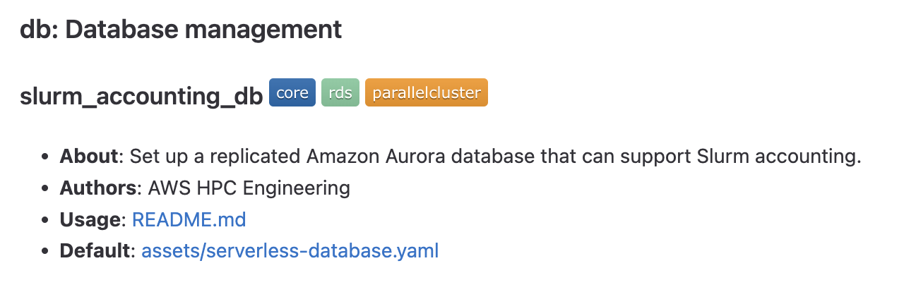

# HPC Recipes for AWS

This repository contains example recipes that demonstrate how to build HPC systems using AWS ParallelCluster, Research and Engineering Studio on AWS, and other AWS products.

## Getting Started

* If you are new to AWS ParallelCluster, you can watch a [5-minute explainer video](https://youtu.be/gmw7A3kOh60).
* If you are new to Research and Engineering Studio on AWS, you can watch a [5-minute explainer video](https://PLACEHOLDER).
* You can launch an HPC cluster in the cloud [with just a few clicks](recipes/pcluster/latest/README.md).
* Do you need help setting up HPC-ready networking? Choose from a [simple example](recipes/net/hpc_basic/README.md) or a [more advanced configuration](recipes/net/hpc_large_scale/README.md).
* There are also examples of setting up HPC-ready filesystems on AWS [for you to try and learn from](recipes/README.md#arrow_right-storage-storage).

To simply explore what's here, the [recipes home page](./recipes/README.md) shows you every recipe. Here is an example of what you'll find:

This is a recipe named **slurm_accounting_db**. It's part of the **db** (database collection). The tags tell us its a **core** recipe (i.e. it's maintained by AWS staff) and that it pertains to Amazon RDS and AWS ParallelCluster. 

## Security

See [CONTRIBUTING](CONTRIBUTING.md#security-issue-notifications) for more information.

## Contributing

We encourage your to contributions to this collection. Read up on our [contribution process and guidelines](CONTRIBUTING.md). Then, head to **[Get Started](docs/start.md)** to begin. 

## License

This repository is licensed under the MIT-0 License. See the [LICENSE](LICENSE) file.

