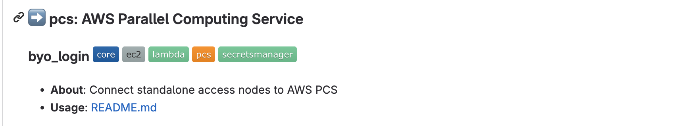

# HPC Recipes for AWS

This repository contains example recipes that demonstrate how to build HPC systems using AWS ParallelCluster and other AWS products.

## Contents

Recipes are in the [recipes](./recipes/README.md) directory. You can find sample networking setups, filesystem configurations, database server deployments, and ParallelCluster deployments. The ParallelCluster recipes are especially interesting since they illustrate a) how to use some advanced features and b) how to integrate ParallelCluster with AWS products such as Amazon FSx for Lustre. 

To aid in discoverability, recipes are indexed in the recipes [README](./recipes/README.md) file. They are organized by theme, such as "db" for database and "net" for networking. Recipes are also tagged to help you determine the most interesting aspects of each recipe. 

Here is an example of what a recipe looks like on the index page:

This recipe is named **slurm_accounting_db** and is a part of the **db** (database collection). Its tags tell us its a core recipe (i.e. it's maintained by AWS staff) and that it pertains to Amazon RDS and AWS ParallelCluster. 

## Getting Started

If you're new to AWS ParallelCluster, start by [reviewing its User Guide](https://docs.aws.amazon.com/parallelcluster/latest/ug/what-is-aws-parallelcluster.html), then try out the [recipes/pcluster/latest](./recipes/pcluster/latest/README.md) recipe. Then, navigate to [recipes](./recipes/README.md) and explore other topics. 

## Security

See [CONTRIBUTING](CONTRIBUTING.md#security-issue-notifications) for more information.

## Contributing

We encourage you to contribute to HPCDK! Read up on our [contribution process and guidelines](CONTRIBUTING.md) and share your best ideas with the HPC community. Then, head to **[Get Started Building for HPCDK](docs/start.md)** to begin. 

## License

This repository is licensed under the MIT-0 License. See the [LICENSE](LICENSE) file.

