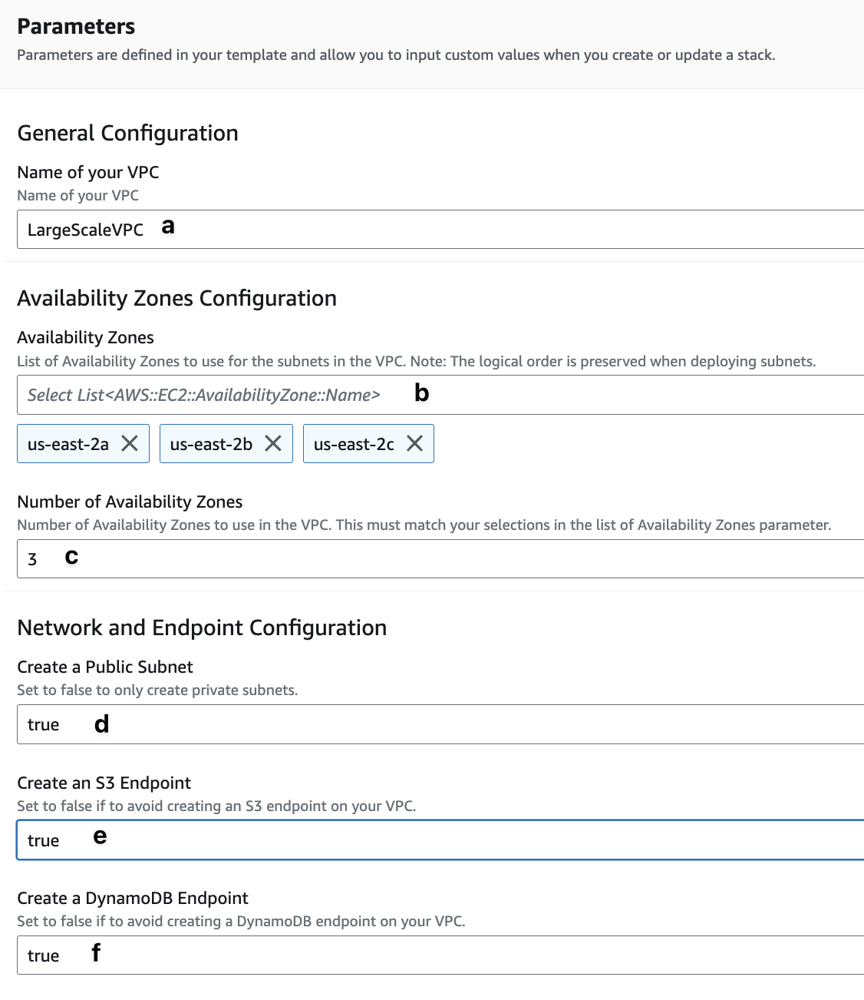

# hpc_large_scale

## Info

A networking setup for large scale computations on AWS.

## Usage

This template prepares a VPC suitable for large-scale computations on AWS. It can provision 
public and private subnets in all selected Availability Zones. It can also deploy an 
Amazon S3 Endpoint, Internet Gateway, and NAT Gateway in the public subnet if you 
choose to.  

The template creates 4 CIDR blocks 10.0.0.0/16, 10.1.0.0/16, 10.2.0.0/16 and
10.3.0.0/16. The first is used for management with the public subnet with the 
public subnet, allowing access to a maximum number of instances. 

If you launch this template in the AWS CloudFormation console, you will find an 
interface resembling this:

## Cost Estimate

* VPC and Subnets - No Charge
* Internet Gateway - No charge, but you pay a small amount for traffic passing out of the VPC.
* NAT Gateway - There will be a region-specific hourly cost for the NAT gatway, plus a charge for data sent through the gateway. See [AWS VPC pricing](https://aws.amazon.com/vpc/pricing/) for details.

## References

This recipe is based on a material developed for the [AWS HPC Workshops](https://github.com/aws-samples/aws-hpc-tutorials/blob/ml/static/template/VPC-Large-Scale.yaml)

