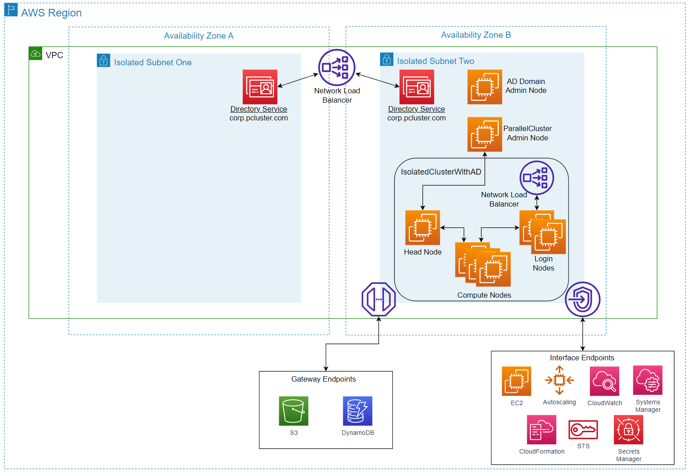
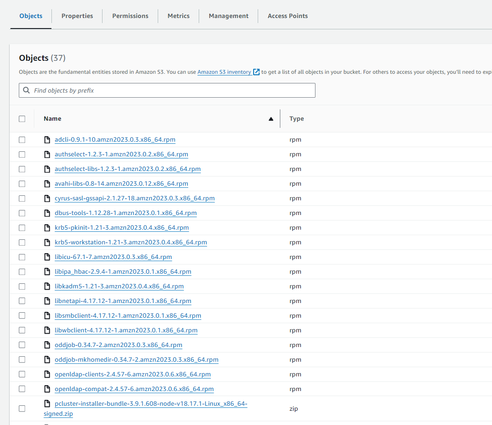
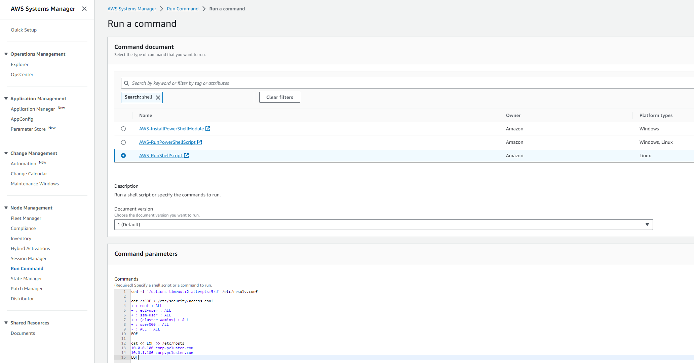
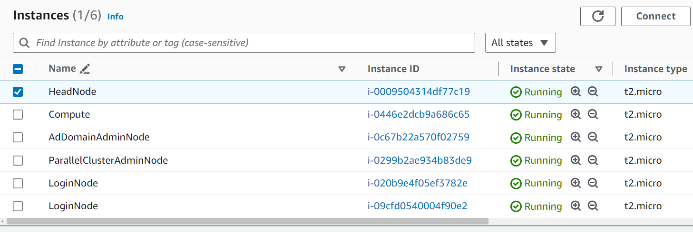

# Securing HPC on AWS - Isolated Clusters

### Isolated HPC Deployment Guide

1.	Browse [here](isolated-hpc.cfn.yml) and download “isolated-hpc.cfn.yml” 
2.	Browse [here](https://docs.aws.amazon.com/parallelcluster/latest/ug/install-v3-install-standalone.html) and download the latest pcluster installer that is contained in step 1 of the Linux x86 (64-bit) instructions. This will download a zip file to your local machine.
3.	Create an S3 bucket

    a.	Navigate to S3 in the AWS Management Console

    b.	Select Create bucket

    c.	Provide a name for the bucket. I will name my bucket 'hpc-isolated' 

    d.	Other settings can be left as default

    e.	Select Create bucket

4.	Upload the pcluster installer zip folder to your newly created S3 bucket. You do NOT need to upload the “isolated-hpc.cfn.yml” file.

    a.	Click on the newly created S3 bucket

    b.	Select Upload

    c.	Select Add files

    d.	Add the file. Your bucket should look like the below, except the S3 bucket name will be different and the zip folder version may different for future releases.  

     
5.	Create an EC2 key pair that can be used to SSH into the instances. If you have already created an EC2 key pair in your account and want to use it for this cluster, you can continue to step 6.

    a.	Navigate to EC2

    b.	Under Network & Security, select Key Pairs

    c.	Select Create key pair

       - Enter a name for the key pair

       - Select RSA as Key pair type

       - Select .pem for Private key file format

       - Select Create key pair

6.	In the AWS Management Console, navigate to CloudFormation and on the right hand side select Create stack->With new resources (standard)
7.	Select Upload a template file and click on the “isolated-hpc.cfn.yml” file and then select Next  

8.	On the specify stack details page

    a. Provide a name for your stack
    
    b. Specify the on premise IP addresses and CIDR blocks for SSH traffic to be used by Administrators and Users. Inputting a 0.0.0.0/0 entry will allow all traffic. It is recommended to lock this down to only allow the IP addresses needed to login and manage the cluster. 

    c. Specify the S3 bucket name you created in step 3. You only need to type the name without any symbols before or after. For example, if you named your bucket hpc-isolated, you would simply type hpc-isolated into this box.
    
    d. Select the Keypair you created in Step 5

    e. Leave the ParallelClusterEC2InstanceAmiId as the default value

9.	On the configure stack options page

    a. Under Stack failure options, select 'Preserve successfully provisioned resources'
    
    b. Under Stack failure options, select 'Delete all newly created resources'

    c. Leave all other values as default, and select Next on the bottom right

10.	On the review page, acknowledge the fact that AWS Cloudformation might create IAM resources and select Submit
11.	You can view the stack’s progress through the CloudFormation page.

    a.	The template will take approximately 15-20 minutes to deploy. 

    b.	Once the stack marked “IsolatedCluster” is CREATE_COMPLETE the process is finished  

12.	You have successfully deployed the infrastructure needed to run ParallelCluster in an isolated environment and launched a sample cluster. 
13. You can now login to the ParallelCluster Admin, Head, Login, and Compute nodes using Systems Manager
    
    a.	Navigate to EC2->Instances and select the box next to the instance you want to login to. Then select Connect. 

    

    b.	Select Session Manager and click on Connect

    c. Keep in mind that you can optionally configure a private connection from on premise locations into AWS (such as Site to Site VPN or Direct Connect Private VIF) so that users can directly access nodes using SSH without a jumpbox or needing public Internet access. It is possible to also restrict Systems Manager such that users can only connect to the Login Nodes. See this [link](https://repost.aws/knowledge-center/ssm-session-manager-control-access) for more details. 

14.	You can login to the ParallelClusterAdminNode to launch new clusters

    a.	Repeat the process described in Step 16 to connect to the ParallelClusterAdminNode

    b. Type sudo su

    c.	Type ‘cd pcluster’

    d.	Type ‘source /root/.bash_profile’

    e. Type 'export AWS_STS_REGIONAL_ENDPOINTS=regional'

    f.	You can now type pcluster commands like ‘pcluster list-official-images’ and 'pcluster create-cluster'. Note that when creating a cluster from an instance in a private subnet (which is what we are doing) you will need to add the suppress validators command in create-cluster. For example, pcluster create-cluster --cluster-name "IsolatedCluster" --cluster-configuration "./IsolatedCluster.yaml" --suppress-validators type:AdditionalIamPolicyValidator --rollback-on-failure false

    g.	The sample ParallelCluster configuration file can be found in this directory by typing ‘cat IsolatedCluster.yaml’ 

15.	You can experiment with installing software on the cluster similarly to how we installed ParallelCluster on the Admin Node. You can upload the software to S3, then utilize the existing private connection between our subnet and S3 to download files. Once those files are on the instance you can install the software locally. [here](example.pcluster.yml)

### Cleanup
1.	Navigate to CloudFormation->Stacks and select “IsolatedCluster”. Select Delete on the top right and confirm by selecting Delete again.
2.	Then select the original stack that you named and delete that one following the same process as Step 1.

### Troubleshooting
1. When attempting to perform ParallelCluster CLI commands, you get an error message stating: "Command not found"

    a. Run the following command: source /etc/profile

2. When attempting to perform ParallelCluster CLI commands, you get an error message stating: "Bad Request: region needs to be set"

    a. Run the following command: source /etc/profile

3. When attempting to launch a cluster, you get an error message stating: "Unable to find node executable"

    a. Run the following command: source /root/.bash_profile

### Isolated HPC with AD Integration Deployment Guide

1.	Browse [here](isolated-hpc-ad-cfn.yml) and download the “isolated-hpc-ad-cfn.yml” file
2.	Browse [here](https://docs.aws.amazon.com/parallelcluster/latest/ug/install-v3-install-standalone.html) and download the latest pcluster installer that is contained in step 1 of the Linux x86 (64-bit) instructions. This will download a zip file to your local machine.
3.  You will need to download files necessary to manage the AWS Directory Service so that users and groups can be created

    a. On a Linux machine with Internet access, download these files using 'sudo yum install -y --downloadonly --downloaddir=. sssd realmd oddjob oddjob-mkhomedir adcli samba-common samba-common-tools krb5-workstation openldap-clients policycoreutils-python3 openssl'

    b. At the time of writing, there are 36 files downloaded and will look similar to the below with certain versions being different in the future 

    

3.	Create an S3 bucket 

    a.	Navigate to S3 in the AWS Management Console

    b.	Select Create bucket

    c.	Provide a name for the bucket. I will name my bucket 'hpc-ad-int'  

    d.	Other settings can be left as default

    e.	Select Create bucket

4.	Upload all files from Steps 2 and 3 to the newly created S3 bucket. You do NOT need to upload the “isolated-hpc-ad-cfn.yml” file to the S3 bucket from Step 1.
    
    a.  If you are using the [AWS CLI](https://aws.amazon.com/cli/), you can use the following command to mass copy the rpm files - aws s3 cp ./ s3://your-s3-bucket/ --recursive --include "*.rpm"	

       - Make sure you change the 'your-s3-bucket' to match the name of the bucket you just created
    
    b.  If you are using the Management Console, click on the newly created S3 bucket
    
    b.	Select Upload
    
    c.	Select Add files
    
    d.	Add all files. Your bucket should look like the below, except the S3 bucket name, file versions, and number of files may be different.     

    
5.	Create an EC2 key pair that can be used to SSH into the instances. If you have already created an EC2 key pair in your account and want to use it for this cluster, you can continue to step 6.
   
    a.	Navigate to EC2
   
    b.	Under Network & Security, select Key Pairs
   
    c.	Select Create key pair    

       - Enter a name for the key pair

       - Select RSA as Key pair type

       - Select .pem for Private key file format

       - Select Create key pair
  
    d.	The file will be downloaded to your local machine

6.	In the AWS Management Console, navigate to CloudFormation and on the right hand side select Create stack->With new resources (standard)
7.	Select Upload a template file and click on the “isolated-hpc-ad-cfn.yml” file and then select Next 
 
8.	On the Specify stack details page
    
    a.	Provide a stack name
   
    b.	Enter passwords for Admin, cluster-admin, ReadOnlyUser, and user000
   
    - For demo purposes, I will be using “p@55w0rd” without the quotes as my password for all four usernames.
   
    c.	Specify the on premise IP addresses and CIDR blocks for SSH traffic to be used by Administrators and Users. Inputting a 0.0.0.0/0 entry will allow all traffic. It is recommended to lock this down to only allow the IP addresses needed to login and manage the cluster. 
    
    d. Specify the S3 bucket name you created in step 3. You only need to type the name without any symbols before or after. For example, if you named your bucket hpc-isolated, you would simply type hpc-isolated into this box.
    
    e.  Select the keypair you created in Step 5
   
    f.	Select Next

9.	On the configure stack options page

    a. Under Stack failure options, select 'Preserve successfully provisioned resources'
    
    b. Under Stack failure options, select 'Delete all newly created resources'

    c. Leave all other values as default, and select Next on the bottom right
    
10.	Scroll all the way down on the Review page and acknowledge the checkboxes. Then select Submit.
11.	You can view the stack’s progress through the CloudFormation page.
   
    a.	Total time for the process to complete is approximately 1 hour. The initial stack used to provision the environment with the VPC, route tables, subnets, Directory service, etc will take approximately 45 minutes to complete. Once complete, you will see a second stack automatically launch to provision the ParallelCluster Head, Login, and Compute Nodes. This will take approximately 15-20 minutes to complete.
    
    

   
    b.	Once the stack marked “IsolatedClusterWithAD” is CREATE_COMPLETE the majority of the process is finished and you can move on to step 15.

12. We will need to modify a few files on the Login Nodes using Systems Manager. Note that at the time of writing, OnNodeConfigured actions are not supported on Login Nodes in the ParallelCluster configuration file. Once this feature becomes available, this step will not be required.

    a. Browse [here](ssm-script.sh) and copy the contents of the "ssm-script.sh" file

    b. In the AWS Management Console, navigate to Systems Manager and then select Run Command on the left hand side.

    c. Select Run command on the right hand side.

    d. In the search window, type 'shell' and select "AWS-RunShellScript"

    e. In the Command parameters window, paste the contents of the "ssm-script.sh" file you copied in 15a. It should look like the below

    

    f. For Target selection, keep the box ticked for Specify instance tags. For Tag key, type Name and Tag value as LoginNode. Then select Add right next to it. Working version looks like the below

     

    g. For Output options, deselect the box next to Enable an S3 bucket. 

    h. Leave all other settings as default and select Run on the bottom right. It should only take a few seconds for the status to show as 'Success'

13.	You have successfully deployed the infrastructure needed to run ParallelCluster in an isolated environment and launched a sample cluster that has Active Directory integration.
14.	You can now login to each node using Systems Manager
   
    a.	Navigate to EC2->Instances and, for example, select the box next to instance named Head Node. Then select Connect.  
   
    
   
    b.	Select Session Manager and click on Connect

    c. Note that users will need access to the AWS Management Console in order to use Systems Manager.

15.	Logging into the cluster

- To preface, we are using the ParallelClusterAdminNode both as a means to install the ParallelCluster CLI and launch clusters, but also as a jumpbox for both Administrators and Users. You can optionally create another EC2 instance to function as a jumpbox, but that is not included in this configuration. 
- Keep in mind that you can optionally configure a private connection from on premise locations into AWS (such as Site to Site VPN or Direct Connect Private Vif) so that users can directly access nodes using SSH without a jumpbox or needing public Internet access. It is possible to also restrict Systems Manager access for users to only allow them to connect to the Login Nodes. See this [link](https://repost.aws/knowledge-center/ssm-session-manager-control-access) for more details. 
- Administrators can login to the Head Node from the ParallelClusterAdminNode with a user that is authenticated to Active Directory. First, connect to the ParallelClusterAdminNode using SSH or Systems Manager. From the CLI of the ParallelClusterAdminNode, type ‘ssh cluster-admin@HEAD_NODE_PRIVATE_IP’. You can find the IP of the head node by navigating to EC2->Instances->Check the box next to head node and you will see the IP address on the bottom right as shown below. 
    
     

    Input the cluster-admin password you created before the CloudFormation template was launched. You are now logged into the head node.  

- Users can connect to the login nodes with a user that is authenticated to Active Directory using ‘ssh user000@NETWORK_LOAD_BALANCER_PRIVATE_DNS’. Note that general users will be connecting to the Login Nodes and NOT the Head Node. To find the load balancer DNS name, navigate to EC2->Load Balancers. One load balancer is being used for AWS Managed AD, and the other is the one we are using for the login nodes. The easiest way to tell which load balancer is needed here is to look under the Availability Zone column. The column that contain a singular entry is the one we need here. Once highlighted, scroll down and look for DNS name on the bottom right. See the below picture for an example.

  
    
- You can use this DNS name to authenticate into the Login Nodes. 

    

16.	You can also launch new clusters from the CLI of the ParrallelClusterAdminNode
   
    a. Type sudo su

    b.	Type ‘cd pcluster’

    c.	Type ‘source /root/.bash_profile’

    d. Type 'export AWS_STS_REGIONAL_ENDPOINTS=regional'

    e.	You can now type pcluster commands like ‘pcluster list-official-images’ and 'pcluster create-cluster'. Note that when creating a cluster from an instance in a private subnet (which is what we are doing) you will need to add the suppress validators command in create-cluster. For example, pcluster create-cluster --cluster-name "IsolatedCluster" --cluster-configuration "./IsolatedClusterWithAD.yaml" --suppress-validators type:AdditionalIamPolicyValidator --rollback-on-failure false

    f.	The sample ParallelCluster configuration file can be found in this directory by typing ‘cat IsolatedCluster.yaml’ 

17.	You can experiment with installing software on the cluster similarly to how we installed ParallelCluster on the ParallelClusterAdminNode. You can upload the software to S3, then utilize the existing private connection between our subnet and S3 to download files. Once those files are on the instance you can install the software locally. Also note that an example parallelcluster configuration file for AD integration can be found [here](example.pcluster-ad.yml)

### Cleanup
1.	Navigate to CloudFormation->Stacks and select “IsolatedClusterWithAD”. Select Delete on the top right and confirm by selecting Delete again.
2.	Then select the original stack that you named and delete that one following the same process as Step 1.

### Troubleshooting
1. When creating the CloudFormation template, it fails at "DomainCertificateSetup"

    a. Select 'Retry' in CloudFormation

2. When attempting to perform ParallelCluster CLI commands, you get an error message stating: "Command not found"

    a. Run the following command: source /etc/profile

3. When attempting to perform ParallelCluster CLI commands, you get an error message stating: "Bad Request: region needs to be set"

    a. Run the following command: source /etc/profile

4. When attempting to launch a cluster, you get an error message stating: "Unable to find node executable"

    a. Run the following command: source /root/.bash_profile