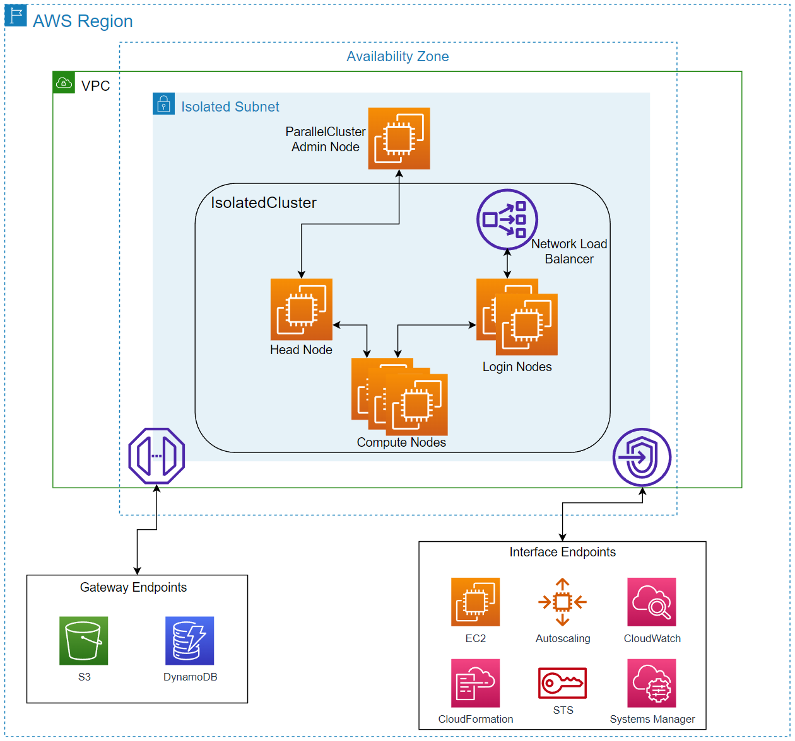
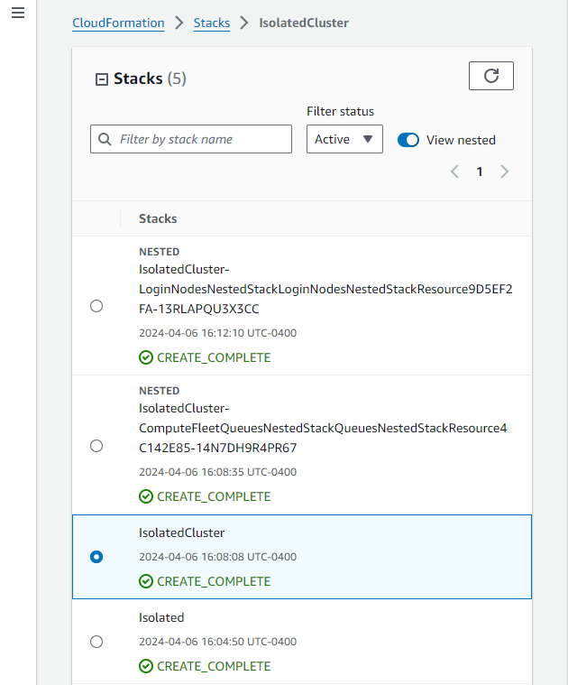
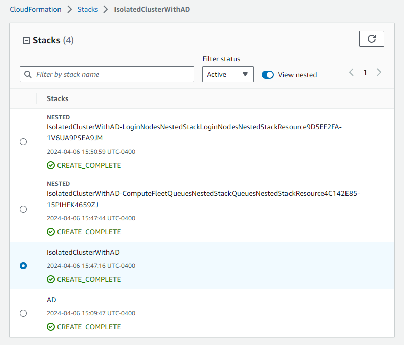
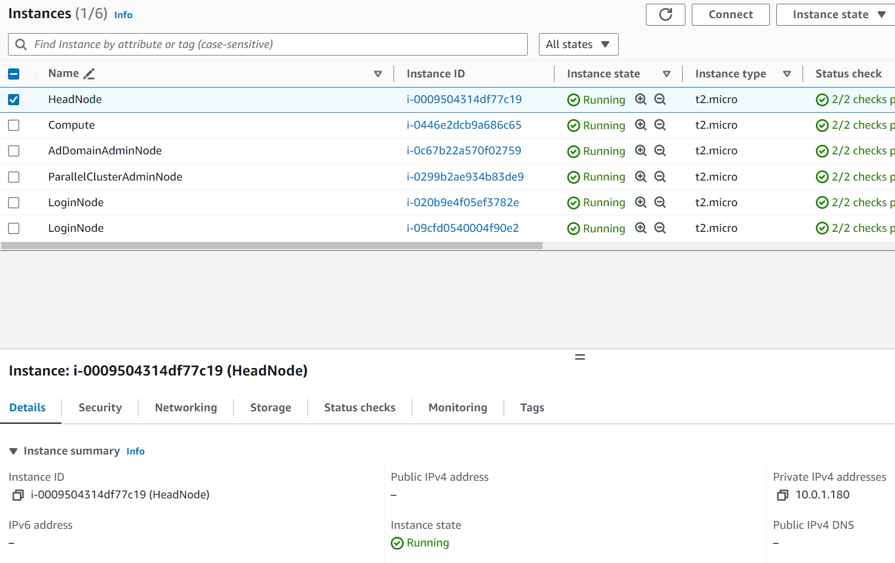

# Securing HPC on AWS - Isolated Clusters

### Isolated HPC Deployment Guide

1.	Browse [here](isolated-hpc.yml) and download “isolated-hpc.yml” 
2.	Browse [here](https://docs.aws.amazon.com/parallelcluster/latest/ug/install-v3-install-standalone.html) and download the latest pcluster installer that is contained in step 1 of the Linux x86 (64-bit) instructions. This will download a zip file to your local machine.
3.	Create an S3 bucket

    a.	Navigate to S3 in the AWS Management Console

    b.	Select Create bucket

    c.	Provide a name for the bucket. I will name my bucket 'hpc-isolated' 

    d.	Other settings can be left as default

    e.	Select Create bucket

4.	Upload the pcluster installer zip folder to your newly created S3 bucket. You do NOT need to upload the “isolated-hpc.yml” file.

    a.	Click on the newly created S3 bucket

    b.	Select Upload

    c.	Select Add files

    d.	Add the file. Your bucket should look like the below, except the S3 bucket name will be different.  

     
5.	Create an EC2 key pair that can be used to SSH into the instances. If you have already created an EC2 key pair in your account and want to use it for this cluster, you can continue to step 6.

    a.	Navigate to EC2

    b.	Under Network & Security, select Key Pairs

    c.	Select Create key pair

       - Enter a name for the key pair

       - Select RSA as Key pair type

       - Select .pem for Private key file format

       - Select Create key pair

6.	Open the “isolated-hpc.yml” file that should be in your Downloads folder on your local computer using a text editor of choice such as Notepad++. 
7.	Press Cntrl+F to bring up the search bar and select the Replace tab. For Find what, type “your-s3-bucket” without the quotes. For Replace with, enter the name of the S3 bucket you created in step 3. If you forgot, or closed the previous tab, you can navigate to S3->Buckets and find the bucket name as shown below.  

    a.	For example, using the bucket shown above which is “hpc-isolated” I would put that in the Replace with section. Then select Replace All and you will replace 4 occurrences in the file. 
    
     

8.	Save the “isolated-hpc-ad-integration.yml” file
9.	In the AWS Management Console, navigate to CloudFormation and on the right hand side select Create stack->With new resources (standard)
10.	Select Upload a template file and click on the “isolated-hpc.yml” file and then select Next  

11.	On the specify stack details page

    a. Specify the on premise IP addresses and CIDR blocks for SSH traffic to be used by Administrators and Users. By default, the 0.0.0.0/0 entry allows all traffic. It is recommended to lock this down to only allow the IP addresses needed to login and manage the cluster. 

    b. Provide a name for your stack and select the Keypair you created in Step 5

    c. Leave the ParallelClusterEC2InstanceAmiId as the default value

12.	On the configure stack options page, select Next
13.	On the review page, acknowledge the fact that AWS Cloudformation might create IAM resources and select Submit
14.	You can view the stack’s progress through the CloudFormation page.

    a.	The template will take approximately 15-20 minutes to deploy. 

    b.	Once the stack marked “IsolatedCluster” is CREATE_COMPLETE the process is finished  

15.	You have successfully deployed the infrastructure needed to run ParallelCluster in an isolated environment and launched a sample cluster. 
16. You can now login to the ParallelCluster Admin, Head, and Compute nodes using Systems Manager
    
    a.	Navigate to EC2->Instances and select the box next to the instance you want to login to. Then select Connect. 

    

    b.	Select Session Manager and click on Connect

17.	You can login to the ParrallelClusterAdminNode to launch new clusters

    a.	Repeat the process described in Step 16 to connect to the ParrallelClusterAdminNode

    b.	Type ‘cd pcluster’

    c.	Type ‘source /etc/profile’

    d.	You can now type pcluster commands like ‘pcluster list-official-images’ and 'pcluster create-cluster'

    e.	The sample ParallelCluster configuration file can be found in this directory by typing ‘cat IsolatedCluster.yaml’ 

18.	You can experiment with installing software on the cluster similarly to how we installed ParallelCluster on the Admin Node. You can upload the software to S3, then utilize the existing private connection between our subnet and S3 to download files securely. Once those files are on the instance you can install the software locally. 

### Cleanup
1.	Navigate to CloudFormation->Stacks and select “IsolatedCluster”. Select Delete and confirm by selecting Delete again.
2.	Then select the original stack that you named and delete that one following the same process as Step 1.

### Isolated HPC with AD Integration Deployment Guide

1.	Browse [here](isolated-hpc-ad-integration.yml) and download the “isolated-hpc-ad-integration.yml” file
2.	Browse [here](https://docs.aws.amazon.com/parallelcluster/latest/ug/install-v3-install-standalone.html) and download the latest pcluster installer that is contained in step 1 of the Linux x86 (64-bit) instructions. This will download a zip file to your local machine.
3.  You will need to download files necessary to manage Active Directory so that users can be created

    a. On a Linux machine with Internet access, download these files using 'sudo yum install -y --downloadonly --downloaddir=. sssd realmd oddjob oddjob-mkhomedir adcli samba-common samba-common-tools krb5-workstation openldap-clients policycoreutils-python3 openssl'

    b. There should be 36 files that are downloaded and will look similar to the below with certain versions being different in the future 

    

3.	Create an S3 bucket 

    a.	Navigate to S3 in the AWS Management Console

    b.	Select Create bucket

    c.	Provide a name for the bucket. I will name my bucket 'hpc-ad-int'  

    d.	Other settings can be left as default

    e.	Select Create bucket

4.	Upload all 37 files from Steps 2 and 3 to the newly created S3 bucket. You do NOT need to upload the “isolated-hpc-ad-integration.yml” file to the S3 bucket from Step 1.
    
    a.  If you are using the AWS CLI, you can use the following command to mass copy the rpm files - aws s3 cp ./ s3://your-s3-bucket/ --recursive --include "*.rpm"	

       - Make sure you change the 'your-s3-bucket' to match the name of the bucket you just created
    
    b.  If you are using the Management Consolole, click on the newly created S3 bucket
    
    b.	Select Upload
    
    c.	Select Add files
    
    d.	Add all 37 files. Your bucket should look like the below, except the S3 bucket name will be different.  

    
5.	Create an EC2 key pair that can be used to SSH into the instances. If you have already created an EC2 key pair in your account and want to use it for this cluster, you can continue to step 6.
   
    a.	Navigate to EC2
   
    b.	Under Network & Security, select Key Pairs
   
    c.	Select Create key pair    

       - Enter a name for the key pair

       - Select RSA as Key pair type

       - Select .pem for Private key file format

       - Select Create key pair
  
    d.	The file will be downloaded to your local machine

6.	Open the “isolated-hpc-ad-integration.yml” file that should be in your Downloads folder on your local computer using a text editor of choice such as Notepad++. 
7.	Press Cntrl+F to bring up the search bar and select the Replace tab. For Find what, type “your-s3-bucket” without the quotes. For Replace with, enter the name of the S3 bucket you created in step 3. If you forgot, or closed the previous tab, you can navigate to S3->Buckets and find the bucket name as shown below.  

-	For example, using the bucket shown above which is “hpc-ad-int” I would put that in the Replace with section. Then select Replace All and you will replace 15 occurrences in the file. 
    
 

8.	Save the “isolated-hpc-ad-integration.yml” file
9.	In the AWS Management Console, navigate to CloudFormation and on the right hand side select Create stack->With new resources (standard)
10.	Select Upload a template file and click on the “isolated-hpc-ad-integration.yml” file and then select Next 
 
11.	On the Specify stack details page
    
    a.	Provide a stack name
   
    b.	Enter passwords for Admin, cluster-admin, ReadOnly, and for user000
   
    - For demo purposes, I will be using “p@ssw0rd” without the quotes as my password for all three usernames.
   
    c.	Specify the on premise IP addresses and CIDR blocks for SSH traffic to be used by Administrators and Users. By default, the 0.0.0.0/0 entry allows all traffic. It is recommended to lock this down to only allow the IP addresses needed to login and manage the cluster. 
    
    d.  Select the keypair you created in Step 5
   
    e.	Select Next

12.	Select Next on the Configure stack options page
13.	Scroll all the way down on the Review page and acknowledge the checkboxes. Then select Submit.
14.	You can view the stack’s progress through the CloudFormation page.
   
    a.	Total time for the process to complete is approximately 1 hour. The initial stack used to provision the environment with the VPC, route tables, subnets, Active Directory, etc will take approximately 45 minutes to complete. Once complete, you will see a second stack automatically launch to provision the ParallelCluster Head and Compute Nodes. This will take approximately 15-20 minutes to complete.
    
    

   
    b.	Once the stack marked “IsolatedClusterWithAD” is CREATE_COMPLETE the process is finished 

15.	You have successfully deployed the infrastructure needed to run ParallelCluster in an isolated environment and launched a sample cluster that has Active Directory integration.
16.	You can now login to each node using Systems Manager
   
    a.	Navigate to EC2->Instances and, for example, select the box next to instance named ParallelClusterAdminNode. Then select Connect.  
   
    
   
    b.	Select Session Manager and click on Connect

    c. Note that users will need access to the AWS Console in order to use Systems Manager.

17.	Logging into the cluster

    a. Administrators can also login to the Head Node from the ParallelClusterAdminNode with a user that is authenticated to Active Directory. First, connect to the ParallelClusterAdminNode using SSH or Systems Manager. From the CLI of the ParallelClusterAdminNode, type ‘ssh cluster-admin@HEAD_NODE_PRIVATE_IP’. You can find the IP of the head node by navigating to EC2->Instances->Check the box next to head node and you will see the IP address on the bottom right as shown below. 
    
     

    Input the cluster-admin password you created before the CloudFormation template was launched. You are now logged into the head node.  

    b. Users can connect to the login nodes with a user that is authenticated to Active Directory. First, connect to the ParallelClusterAdminNode using SSH or Systems Manager. From the CLI of the ParallelClusterAdminNode, type ‘ssh user000@NETWORK_LOAD_BALANCER_PRIVATE_DNS’. Note that users will be connecting to the Login Nodes and NOT the Head Node which is the case for Administrators. To find the load balancer DNS name, navigate to EC2->Load Balancers. One load balancer is being used for AWS Managed AD, and the other is the one we are using for the login nodes. The easiest way to tell which load balancer is needed here is to look for under the Availability Zone column. The entry that contain a singular entry is the one one that is needed. Once highlighted, scroll down and look for DNS name on the bottom left. See the below picture for an example.

  
    
    Keep in mind that you can optionally configure a private connection from on premise locations into AWS (such as Site to Site VPN or Direct Connect Private Vif) so that users can directly access the Login Nodes. This would make the jump box to the ParallelClusterAdminNode unnecesary. Another option is to restrict Systems Manager access for users to only allow them to connect to the Login Nodes. See this [link](https://repost.aws/knowledge-center/ssm-session-manager-control-access) for more details.  

19.	You can also launch new clusters from the CLI of the ParrallelClusterAdminNode
   
    a.	The sample ParallelCluster configuration file can be found in the /usr/bin/plcuster directory by typing ‘cat IsolatedClusterWithAD.yaml’ 

20.	You can experiment with installing software on the cluster similarly to how we installed ParallelCluster on the ParrallelClusterAdminNode. You can upload the software to S3, then utilize the existing private connection between our subnet and S3 to download files securely. Once those files are on the instance you can install the software locally. 

### Cleanup
1.	Navigate to CloudFormation->Stacks and select “IsolatedClusterWithAD”. Select Delete and confirm by selecting Delete again.
2.	Then select the original stack that you named and delete that one following the same process as Step 1.

### Troubleshooting
1. When attempting to perform ParallelCluster CLI commands, you get an error message stating: "Command not found"

    a. Run the following command: source /etc/profile

2. When attempting to perform ParallelCluster CLI commands, you get an error message stating: "Bad Request: region needs to be set"

    a. Run the following command: source /etc/profile

3. When attempting to launch a cluster, you get an error message stating: "Unable to find node executable"

    a. Run the following command: source /etc/profile