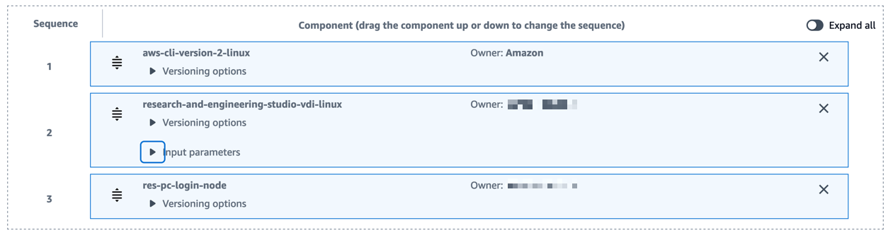

# Login Node for Research and Engineering Studio (RES)

## Info

This recipe allows the creation of a [ParallelCluster (PC) Login Node](https://docs.aws.amazon.com/parallelcluster/latest/ug/login-nodes-v3.html) AMI compatible with [Research and Engineering Studio (RES)](https://github.com/aws/res). The Login Node AMI can be used in a RES as a software stack to integrate with ParallelCluster.

## Usage

### 1. Create RES compatible ParallelCluster Login Node AMI

The following steps must be done for the ParallelCluster environment to create a RES compatible ParallelCluster Login Node.

#### 1.1. Deploy Login Node AMI automation

You can launch this template by following this quick-create link:

- Create [Login Node AMI for RES](https://console.aws.amazon.com/cloudformation/home?region=us-east-1#/stacks/create/review?stackName=loginnode-for-res&templateURL=https://aws-hpc-recipes.s3.us-east-1.amazonaws.com/main/recipes/pcluster/login_node_for_res/assets/main.yaml)

If you don't wish to use the quick-create link, you can also download the [assets/main.yml](assets/main.yaml) file and uploading it to [AWS CloudFormation console](https://console.aws.amazon.com/cloudformation).

#### 1.2. Create RES-compatible ParallelCluster LoginNode AMI

Trigger the SSM automation to create an AMI of a LoginNode for ParallelCluster. This AMI ID will be used later on during the **EC2 Image Builder recipe** configuration.

1. Download [configure_login_node_for_res.sh](assets/configure_login_node_for_res.sh).
2. Run `configure_login_node_for_res.sh` once your Login Node is ready for snapshot. Update the following parameters accordingly.
   1. `SSM_DOCUMENT` = `ConfigureLoginNodeforRES` CloudFormation output value from Step 1.1
   2. `PCLUSTER_STACK_NAME` = ParallelCluster stack name

```bash
Usage: ./configure_login_node_for_res.sh <SSM_DOCUMENT> <PCLUSTER_STACK_NAME>
```

**Note:** If execution times out, check Systems Manager for the Automation execution.
_Systems Manager -> Automation -> {{execution id from command output}}_
e.g. `cd95c7b6-9999-aaaa-9beb-7c4bdbd57900`

_sample output_

```
[-] Automation execution started with ID: cd95c7b6-9999-aaaa-9beb-7c4bdbd57900
[-] Waiting for automation execution to complete... Retrying in 20s
[-] Waiting for automation execution to complete... Retrying in 20s
[-] Waiting for automation execution to complete... Retrying in 20s
[-] Waiting for automation execution to complete... Retrying in 20s
[-] Waiting for automation execution to complete... Retrying in 20s
[-] Waiting for automation execution to complete... Retrying in 20s
[-] Waiting for automation execution to complete... Retrying in 20s
[-] Waiting for automation execution to complete... Retrying in 20s
[-] Waiting for automation execution to complete... Retrying in 20s
[-] Waiting for automation execution to complete... Retrying in 20s
[-] Waiting for automation execution to complete... Retrying in 20s
[-] Automation execution completed successfully.
[-] Outputs: ami-xxxxxxxxxxxx
Done!
```

### 2. Configure RES-ready AMI

Follow the steps outlined in [configure RES-ready AMI(s)](https://docs.aws.amazon.com/res/latest/ug/res-ready-ami.html) to build the RES-ready AMI for a PC Login Node.

When [Preparing the EC2 Image Builder Recipe](https://docs.aws.amazon.com/res/latest/ug/res-ready-ami.html#prepare-recipe) please refer to the following:

1/ The Base image in _step 5_ should be the custom AMI that was created in Step 1.2 above.


2/ Add the `res-pc-login-node` component to the **Build components** list to configure the AMI to be compatible with a RES VDI



3/ Add the appropriate KMS key under **Storage** section.

By default the Login Node uses `/alias/aws/ebs`


### 3. Create / Update RES project

1/ Create or Update a project in RES to incorporate the required security group `RESPCLoginNodeSG` to allow VDI access to ParallelCluster.


### 4. Create Software stack in RES for Login Node

Create a Software Stack in RES which uses the new RES-ready AMI. Use the following steps to create a ParallelCluster LoginNode Software Stack in RES.

1.  Login to RES as an Administrator
2.  Select **Software Stacks**
3.  Select **Register Software Stack**
    1.  **Name**: LoginNode-<cluster-name>
    2.  **Description**: LoginNode for cluster <cluster-name>
    3.  **AMI ID**: <Output from `configure_login_node_for_res.sh`>
    4.  **Operating System**: <Select the OS used for the ParallelCluster - e.g. alinux2>
    5.  **Min Storage Size**: 40GB
    6.  **Min Ram**: 10GB
    7.  Select Project(s) to associate the stack.
    8.  Select **Submit**

### 5. Deploy Login Node Virtual Desktop

Deploy a Virtual Desktop using the newly created/updated project and Software stack.

You now have a Virtual Desktop instance capable of submitting jobs to ParallelCluster!


## Cost Estimate

Costs for this solution is less than $1.00/month.
