# Securing HPC with NIST SP 800-223 on AWS
This recipe aims to instruct and guide users how to build a cloud HPC for the new NIST SP 800-223 standard using AWS Parallel Cluster.
The National Institute of Standards and Technology (NIST) has published [NIST SP 800-223: High-Performance Computing (HPC) Security: Architecture, Threat Analysis, and Security Posture](https://csrc.nist.gov/pubs/sp/800/223/final). This new publication provides guidance on how to configure and secure a HPC cluster. This builder project aims to instruct and guide users on how to build a cloud HPC for the new NIST SP 800-223 compliance using AWS CloudFormation and AWS Parallel Cluster.


- [Securing HPC with NIST SP 800-223 on AWS](#securing-hpc-with-nist-sp-800-223-on-aws)
  - [Overview](#overview)
  - [Architecture Overview](#architecture-overview)
    - [Architecture diagrams](#architecture-diagrams)
    - [Cost](#cost)
    - [Cost Table](#cost-table)
    - [Security](#security)
  - [Prerequisites](#prerequisites)
    - [SSH Access](#ssh-access)
    - [AWS account requirements (If applicable)](#aws-account-requirements-if-applicable)
  - [Deployment Steps](#deployment-steps)
    - [Default Stack Names](#default-stack-names)
  - [Deployment Validation](#deployment-validation)
  - [Next Steps](#next-steps)
    - [Login via SSM](#login-via-ssm)
    - [Login via SSH](#login-via-ssh)
  - [Cleanup](#cleanup)

## Overview

Amazon Web Services (AWS) provides the most elastic and scalable cloud infrastructure to run your hpc workloads. With virtually unlimited capacity - engineers, researchers, HPC system administrators, and organizations can innovate beyond the limitations of on-premises HPC infrastructure.

High Performance Compute (HPC) on AWS removes the long wait times and lost productivity often associated with on-premises HPC clusters. Flexible HPC cluster configurations and virtually unlimited scalability allows you to grow and shrink your infrastructure as your workloads dictate, not the other way around.

This guidance provides a comprehensive approach to deploying a secure, compliant, and high-performance HPC environment on AWS. It addresses the unique security challenges of HPC systems while maintaining the performance requirements critical for computationally intensive workloads.

We developed this guidance in response to the growing need for secure HPC environments in cloud settings. Many organizations, especially those in research, engineering, and data-intensive fields, require immense computational power but struggle to balance this with stringent security and compliance requirements. The NIST SP 800-223 publication provides an excellent framework for addressing these challenges, and we wanted to demonstrate how to implement these recommendations using AWS services.

## Architecture Overview

### Architecture diagrams

Architecture diagrams below show sample NIST 800-223 based architecture, provisoning and deployment process using cloudformation, HPC Cluster deployment, and user interactions via AWS ParallelCluster.  Depending on the region you deploy the recipe in, it will automatically scale to from 2-4 AZs in order to maximize availability and redundancy of your cluster.

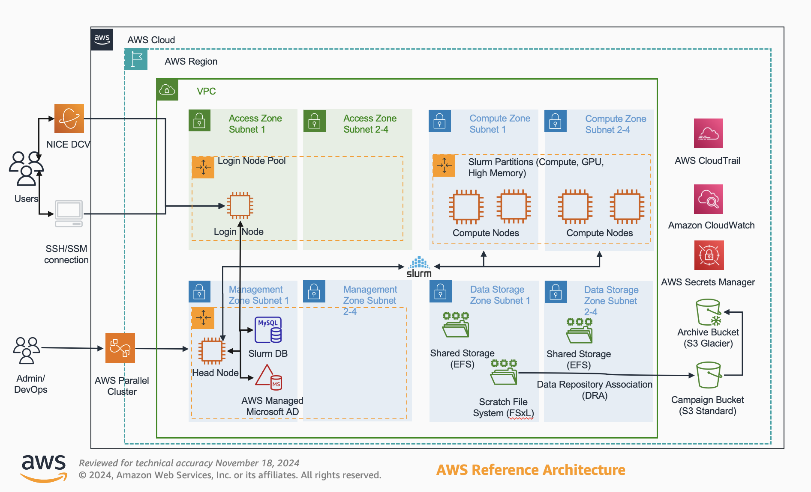

### Cost

You are responsible for the cost of the AWS services used while running this Guidance. As of November 2024, the cost for running this Guidance with the default settings in the US East (N. Virginia) region is approximately $1,156 per month.

We recommend creating a [Budget](https://docs.aws.amazon.com/cost-management/latest/userguide/budgets-managing-costs.html) through [AWS Cost Explorer](https://aws.amazon.com/aws-cost-management/aws-cost-explorer/) to help manage costs. Prices are subject to change. For full details, refer to the pricing webpage for each AWS service used in this Guidance.

### Cost Table

The following table provides a sample cost breakdown for deploying this Guidance with the default parameters in the US East (N. Virginia) Region for one month.

| Stack Name  | AWS Services | Cost [USD] |
| ----------- | ------------ | ------------ |
| Network | VPC, Subnets, NAT Gateway, VPC Endpoints  | $596.85/month |
| Security | Security Groups | $0.00/month |
| Storage | S3, EFS, FSx, EBS | $172.19/month |
| Slurm Accounting | RDS Database | $73.84/month |
| Active Directory | Managed AD (Enterprise)  | $288.00/month |
| Cluster | Head node, Login node | $25.00/month |

***Note: This focus of this Guidance is to provide an example of securing the underlying AWS services and infrastructure that an HPC cluster will eventually run on.  It does not aim to include any costs related to running an actual HPC workload.  Please use the [AWS Pricing Calculator](https://calculator.aws/) to estimate any additional costs related to your specific HPC workload usecase.***

### Security

When you build systems on AWS infrastructure, security responsibilities are shared between you and AWS. This [shared responsibility
model](https://aws.amazon.com/compliance/shared-responsibility-model/) reduces your operational burden because AWS operates, manages, and
controls the components including the host operating system, the virtualization layer, and the physical security of the facilities in
which the services operate. For more information about AWS security, visit [AWS Cloud Security](http://aws.amazon.com/security/).

[AWS ParallelCluster](https://aws.amazon.com/hpc/parallelcluster/) users can be securely authenticiated and authorized using [Amazon Manageged Microsoft Active Directory](https://aws.amazon.com/directoryservice/). HPC cluster EC2 components are deployed into a Virtual Private Cloud (VPC) which provides additional network security isolation for all contained components. Login Node is depoyed into a Public subnet and available for access via secure connections (SSH and SSM), Head Node is depoyed into a Private subnet and available for access via secure connections (SSH and SSM), compute nodes are deployed into Private subnet and managed from Head node via SLURM package manager, Slurm accounting database is deployed into a Private subnet and managed from the Head node using Slurm. Data stored in Amazon S3, Amazon EFS, and Amazon FSx for Lustre is [enrypted at rest and in transit](https://docs.aws.amazon.com/whitepapers/latest/logical-separation/encrypting-data-at-rest-and--in-transit.html).  Access to other AWS services from AWS ParallelCluster components are secured over [VPC Endpoints](https://docs.aws.amazon.com/whitepapers/latest/aws-privatelink/what-are-vpc-endpoints.html) from a Private management subnet.

See [CONTRIBUTING](CONTRIBUTING.md#security-issue-notifications) for more information.

## Prerequisites

### SSH Access

If you prefer to use SSH to access the login node or head node you will need to create a new SSH keypair in your account ***before*** launching the ParallelCluster CloudFormation template.

To do that:
1. Login to your AWS account
2. In the search bar at the top of the screen type in EC2
3. In the list of services select EC2
4. In the left-hand menu select Key Pairs under the Network & Security section
5. Click Create key pair
6. Enter a key pair name
7. Select your preferred key pair type and format and click Create key pair
8. This will automatically start a download of the private key for the key pair you just created
9. Save this key in a secure location (this key can act as your password to login to the nodes launched by this template)

### AWS account requirements (If applicable)

This deployment requires you have access to Amazon CloudFormation in your AWS account with permissions to create the following resources”

**AWS Services Used:**

- [Amazon VPC](https://aws.amazon.com/vpc/)
- [Amazon CloudWatch](https://aws.amazon.com/cloudwatch/)
- [Amazon Identity and Access Management (IAM)](https://aws.amazon.com/iam/)
- [Amazon Elastic Compute Cloud (EC2)](https://aws.amazon.com/ec2/)
- [Amazon Elastic File System (EFS)](https://aws.amazon.com/efs/)
- [Amazon Elastic Block Store (EBS)](https://aws.amazon.com/ebs/)
- [Amazon FSx for Lustre (FSxL)](https://aws.amazon.com/fsx/lustre/)
- [Amazon Relational Database Service (RDS)](https://aws.amazon.com/rds/)
- [Amazon Dirctory Service](https://aws.amazon.com/directoryservice/)
- [AWS Secrets Manager](https://aws.amazon.com/secrets-manager/)
- [AWS Systems Manager](https://aws.amazon.com/systems-manager/)
- [All service used by AWS ParallelCluster](https://aws.amazon.com/hpc/parallelcluster/)

## Deployment Steps

1. Clone the repo:
   - ```git clone https://github.com/aws-samples/aws-hpc-recipes.git```
2. cd to the deployment folder inside the repo
   - ```cd recipes/pcluster/nist-800-223/```
3. Locate the six Amazon CloudFormation templates and review them in order in a text editor of your choice or in the Amazon CloudFormation console
   - In most cases you will want to use the default settings, however, you have the ability to modify these templates to your specific needs
4. Open a browser and login to your AWS Account
5. Locate the search bar at the top of your screen and type in CloudFormation
6. When presented with a list of services click CloudFormation to open the CloudFormation console

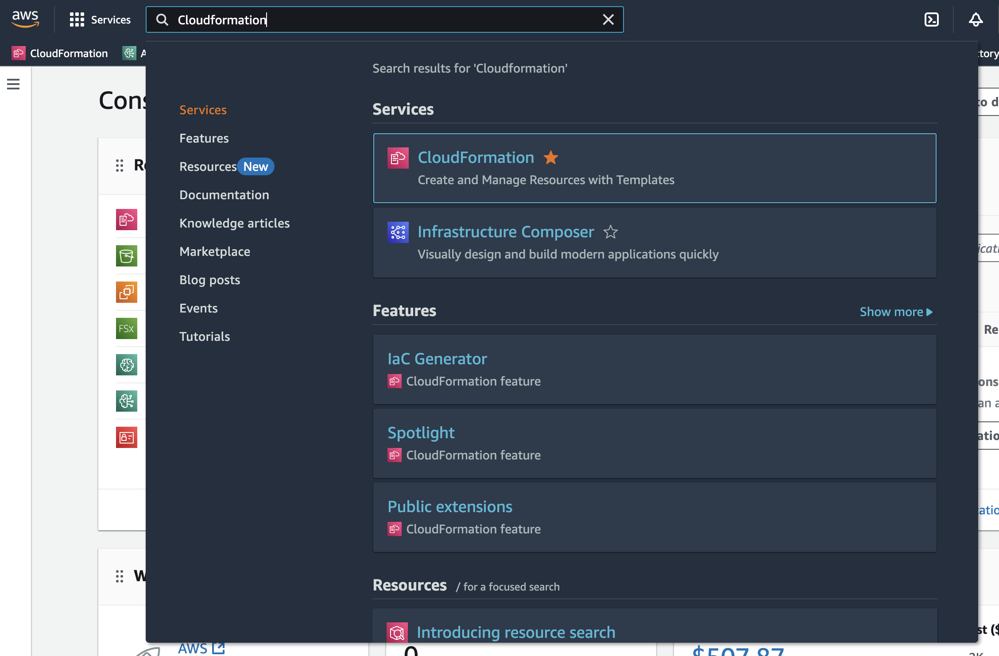

1. Click the Create Stack button

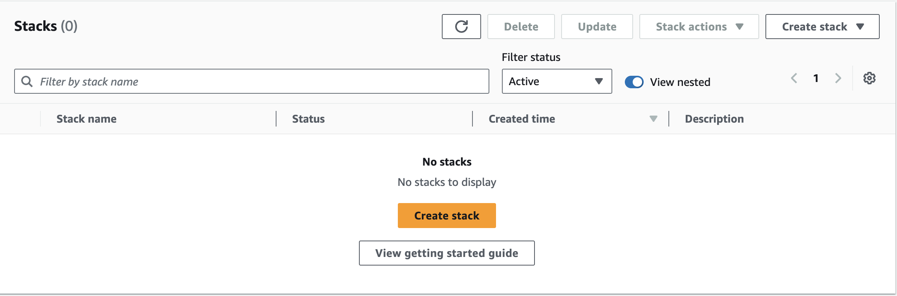

1. In the "Prepare template" section select "Choose an existing template"

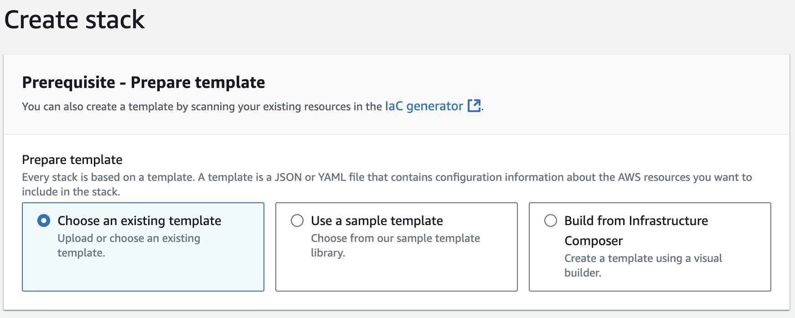

1. In the "Specifiy teamplate" section select "Upload a template file"
2.  Click the "Choose file" button

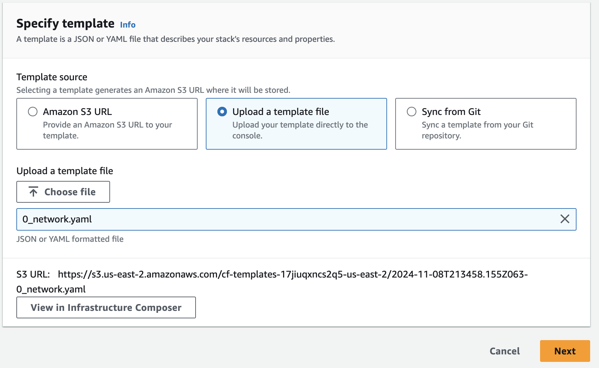

1.  Navigate to the location on your local computer where you clone the repo too and go to the deployment folder.  There you will find the CloudFormation templates prefaced with a number that will indicate the order to execute them in.
2.  Select the first template titled "0_network.yaml"
3.  For each template you will be asked to provide a Stack name, this name must be a unique stack name for the region you are deploying in.

***Important: The stack name should be noted for use in later templates.  Downstream services will need to know this stack name in order to reference Amazon Resource Names (ARNs) or resource IDs that will be exported/output for each template***

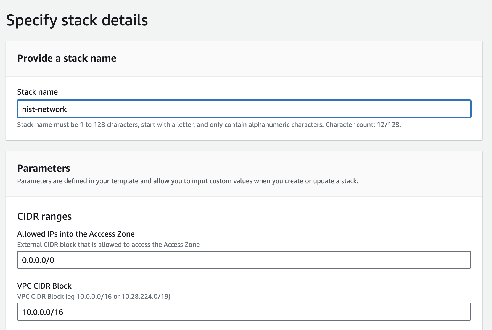

1.  For the network stack review the parameters and adjust as needed based on your specific use case or requirements
2.  Once you have reviewed and validated the parameters click the Next button at the bottom of the page
3.  Leave the default options on the "Configure stack options" page
4.  You will need to scroll to the bottom of this page and select the check box to allow CloudFormation to create IAM resources on your behlaf
5.  Click Next

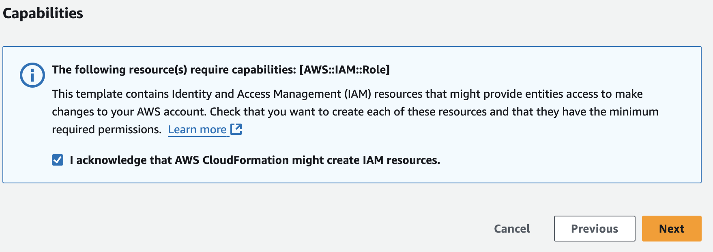

1.  On the "Review and create" screen review your selections one last time and then click the Submit button at the bottom of the page.

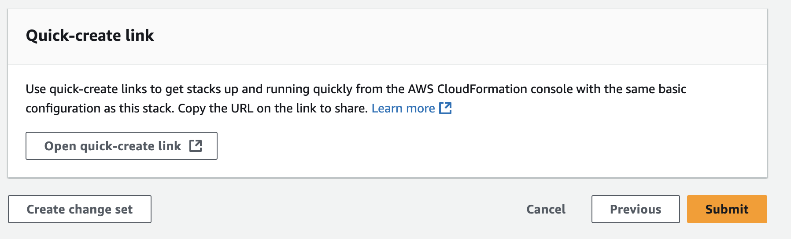

1.  Your CloudFormation stack will begin deploying
2.  You can monitor the progress of the deployment with in the CloudFormation console

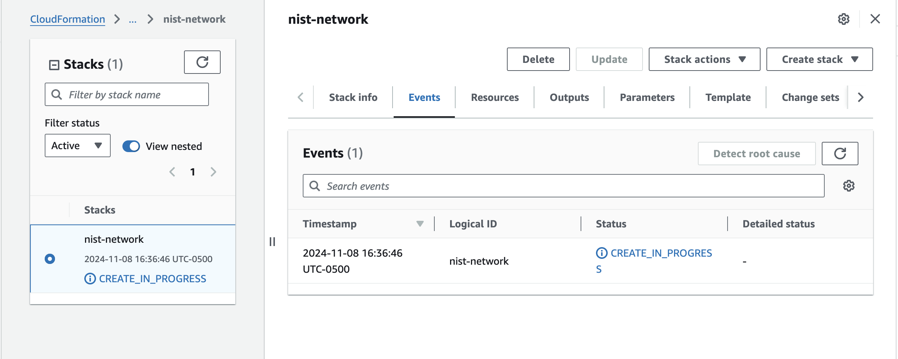

1.  Wait until you see the stack status update from "CREATE_IN_PROGRESS" to "CREATE_COMPLETE" before moving on to the next template
2.  You can review the outputs generated by the stack by going to the Outputs tab for each stack or going to the Exports page on the left-hand menu
    - ***Note: The export values will be used by later templates to reference resources created in earlier templates***

Outputs View

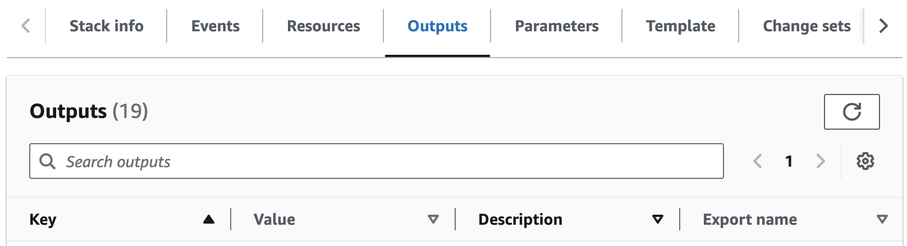

Exports View
   
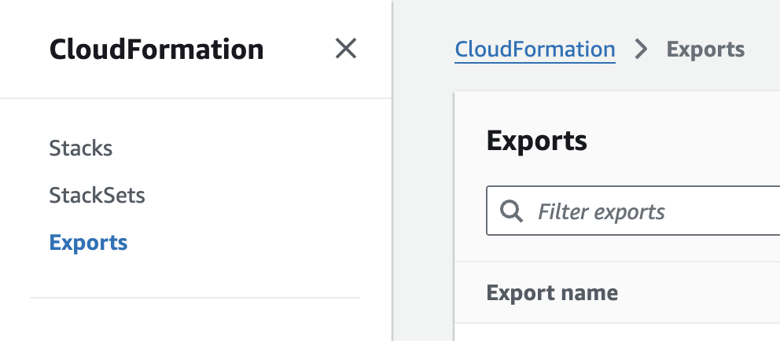

1. Repeat the steps above starting with step 7. moving on to the next stack in the deployment folder

***Important: Stacks 1-5 will have a parameter that asks for the previous stack names.  If you modify the stack names from the default values, you will need to also update the parameters in each subsequent stack with the appropriate name so that the relevant services can be referenced.***

***Note: The storage, Slurm database, Active Directory, and AWS ParallelCluster stacks are intended to be simple examples for testing the NIST SP 800-223 reference architecture.  For more production ready versions of these templates see our [HPC Recipes](https://github.com/aws-samples/aws-hpc-recipes/tree/main/recipes) repo***

### Default Stack Names

| Template File Name  | Stack Name  |
| ----------- | ------------ |
| 0_network.yaml | nist-network  |
| 1_security.yaml | nist-security  |
| 2_storage.yaml | nist-storage  |
| 3_slurm_db.yaml | nist-database  |
| 4_active_directory.yaml | nist-ad  |
| 5_pcluster.yaml | nist-hpc  |

## Deployment Validation 

* Open CloudFormation console and verify the status of the template with the name starting with each of the names above.


* Make sure that all CloudFormation stacks have a status of "CREATE_COMPLETE"


## Next Steps 

You now have successfully deployed the infrastructure need to comply with the guidelines and recommendations outlined in NIST SP 800-223.

You can begin using the cluster by logging into either the Login Node to submit a job or to the management node to review or modify any of the Slurm settings.  You can use SSM to securely open a terminal session to either the login node or the head node by:

### Login via SSM 

1. In the search bar above type in EC2
2. In the list of services select EC2
3. On the left hand menu select Instances
4. Locate either the head node or the login node and select one instance by checking the box to the left of the instance
5. Locate the Connect button near the top of the screen
6. In the window that opens click the Session Manager tab
7. Click the connect button to open a secure terminal session in your browser

### Login via SSH

Alternative, when you launch the 5_pcluster.yaml CloudFormation template you can select an SSH Key pair that exists in your AWS Account.  If you completed the prerequistes steps to create a key pair you will see it populated in this list.

1. Locate your ssh key pair
2. Ensure you have the proper permissions set on the key pair (read-only access)
   ```chmod 400 /path/key/ssh_key.pem```
3. In the list of services select EC2
4. On the left hand menu select Instances
5. Locate either the head node or the login node and select one instance by checking the box to the left of the instance
6. Locate the Connect button near the top of the screen
7. In the window that opens click the SSH client tab
8. Follow the instructions on the screen to login to your instance

## Cleanup

1. In the AWS Management Console, navigate to CloudFormation and locate the 6 stacks deployed
2. Starting with the most recent stack (not including any nested stacks), select the stack and click delete
3. Repeat this for each of the 6 stacks deployed to remove all resources from your account
