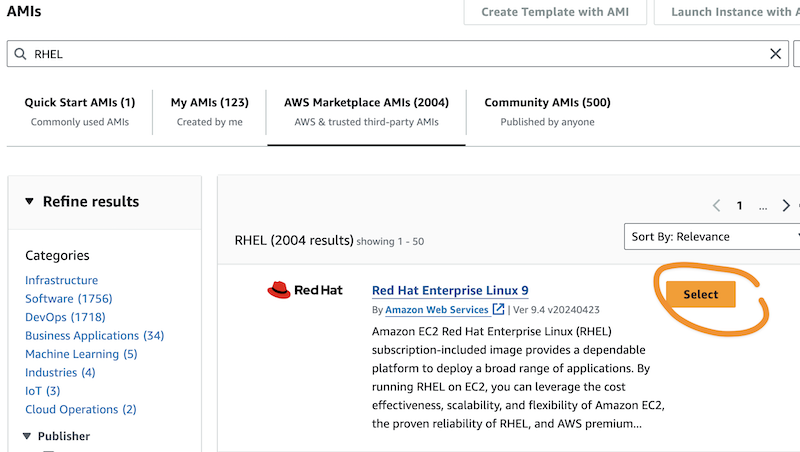
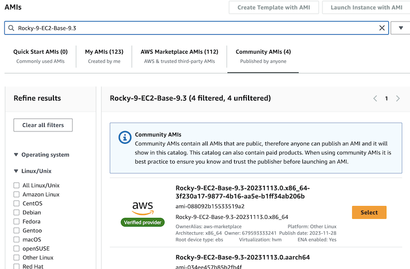

# HPC-ready AMIs

```
################################################################################
While this recipe is in development, its assets are downloadable at:

HpcRecipesS3Bucket: aws-hpc-recipes-dev
HpcRecipesS3Branch: pcsami

Example: https://aws-hpc-recipes-dev.s3.us-east-1.amazonaws.com/pcsami/recipes/pcs/hpc_ready_ami/assets/scripts/update-os.sh
################################################################################
```

## Info

This recipe is designed to support you building your own AMIs to use with AWS PCS. 

It contains three types of resource:
1. Scripts 
2. [EC2 ImageBuilder](https://docs.aws.amazon.com/imagebuilder/latest/userguide/what-is-image-builder.html) assets
3. [HashiCorp Packer](https://www.packer.io/) resources

## Usage

You can use these resources as-is, fork the repository and adapt them to your own needs, or contibute your own knowledge and AMI management code back to HPC recipes. You can also, of course, just read them over to learn how other people are building AMIs for PCS.

### Scripts

In the [scripts](assets/scripts/) directory, you will find a growing number of scripts that can be used to install and/or configure software on an AMI. The scripts are designed to support the same operating system distributions and versions as AWS PCS (currently: Amazon Linux 2, RHEL 9, Rocky Linux 9, and Ubuntu 22.04). 

They're organized around using a shared Bash [script](assets/scripts/common.sh) to detect the operating system distribution, version, and architecture. This makes them extensible in the future, and straightforward to reason about and debug.

Some scripts accept parameters that control their installation or configuration behavior. For example, [`install-spack.sh`](assets/scripts/install-spack.sh) allows you to specify the destination where Spack will be installed. 

You can incorporate these scripts into your own processes. They are available for download via HPC Recipes public URLs, as described below. 

### EC2 ImageBuilder Assets

We provide CloudFormation templates that let you create EC2 ImageBuilder components that use the HPC-ready AMI scripts. They can be found in the [components](assets/components/) directory. The Image Builder component filename maps 1:1 to the name of the script. 

For example, the file [install-ssm-agent.yaml](assets/components/install-ssm-agent.yaml) can create an Image Builder component named `SsmAgentInstaller` that uses the [install-ssm-agent.sh](assets/scripts/install-ssm-agent.sh) to install [SSM Agent](https://docs.aws.amazon.com/systems-manager/latest/userguide/ssm-agent.html) on the AMI. 

The ImageBuilder components are available as individual templates that deploy a CloudFormation stack. There is also a [meta-template](assets/imagebuilder-components.yaml) that will create all available ImageBuilder components at once, using nested CloudFormation stacks. 

#### Deploy all ImageBuilder components [recommended]

1. Navigate to the [AWS CloudFormation console](https://console.aws.amazon.com/cloudformation)
2. Choose **Create stack**, then upload [imagebuilder-components.yaml](assets/imagebuilder-components.yaml) as the template. 
3. In Parameters:
    * For **HpcRecipesS3Bucket** choose the HPC Recipes bucket where the component is hosted. Unless you are working with a pre-release version of HPC Recipes for AWS, this will be `aws-hpc-recipes`.
    * For **HpcRecipesBranch**, enter the release branch for the HPC Recipes bucket. Unless you are working with a pre-release version of HPC Recipes for AWS, this will be `main`.
4. Finish creating the stack. 
5. When the stack's status reaches `CREATE_COMPLETE`, navigate to the [EC2 Image Builder console](https://console.aws.amazon.com/imagebuilder/home#/components).
    * On the **Components** page, choose **Onwed by me**. Your new ImageBuilder components should be available there. 

#### Deploy a single ImageBuilder component

1. Choose one of the YAML file templates in the [components](assets/components/) directory
2. Navigate to the [AWS CloudFormation console](https://console.aws.amazon.com/cloudformation)
3. Choose **Create stack**, then upload the YAML file you have chosen
4. In Parameters:
    * For **HpcRecipesS3Bucket** choose the HPC Recipes bucket where the component is hosted. Unless you are working with a pre-release version of HPC Recipes for AWS, this will be `aws-hpc-recipes`.
    * For **HpcRecipesBranch**, enter the release branch for the HPC Recipes bucket. Unless you are working with a pre-release version of HPC Recipes for AWS, this will be `main`.
5. Finish creating the stack. When its status reaches `CREATE_COMPLETE`, navigate to the [EC2 Image Builder console](https://console.aws.amazon.com/imagebuilder/home#/components).
    * On the **Components** page, choose **Onwed by me**. Your new ImageBuilder component should be avilable there. 

#### Use the example all-in-one ImageBuilder template

Check out the HPC recipes repo or download the [CloudFormation template](assets/create-pcs-image.yaml). Set the HPC Recipes path variables in the shell, then run the following command. 

```shell
HpcRecipesS3Bucket="aws-hpc-recipes-dev"
HpcRecipesBranch="pcsami"

stack_id=$(aws cloudformation create-stack \
               --region us-east-2 \
               --capabilities "CAPABILITY_NAMED_IAM" "CAPABILITY_AUTO_EXPAND" \
               --parameters \
               ParameterKey=Distro,ParameterValue=rocky-9 \
               ParameterKey=Architecture,ParameterValue=arm64 \
               ParameterKey=Vendor,ParameterValue=aws \
               ParameterKey=SemanticVersion,ParameterValue=$(date +%Y.%m.%d) \
               ParameterKey=HpcRecipesS3Bucket,ParameterValue="${HpcRecipesS3Bucket}" \
               ParameterKey=HpcRecipesBranch,ParameterValue="${HpcRecipesBranch}" \
               --output text \
               --query "StackId" \
               --stack-name "buildPCSImages" \
               --template-body file://$PWD/create-pcs-image.yaml)
```

This will create an [ImageBuilder image](https://console.aws.amazon.com/imagebuilder/home#/images) named **pcs_ami-rocky-9-arm64-aws**, which will in turn build an AMI named **pcs_ami-rocky-9-arm64-aws <TIMESTAMP>**. 

**Notes:**
1. The example template is restricted to `us-east-2` because the AMI IDs are hard-coded. To change regions, look them up and change them as needed in the template.
2. Uncomment and add AWS IDs to `LaunchPermissionConfiguration` in the template to share the AMI with additional accounts once it is built.

### HashiCorp Packer resources

Logic for each ImageBuilder component is kept in standalone scripts. This adds a little complexity to the development process, but means we have a source of truth for AMI management actions that is agnostic to the build system being used. We use this to implement Packer infrastructure that can build HPC-ready AMIs. 

#### Build an HPC-ready Amazon Linux 2 AMI

By default, the Packer template builds an Amazon Linux 2 AMI for Intel x86_64 instances in us-east-2.

To build an AMI, run this command:

```shell
packer build \
  template.json
```

This result in an AMI named `hpc_ready_ami-amzn_2-x86_64-intel-TIMESTAMP`.

#### Building other distributions and architectures

The template supports several parameters that control the distribution and architecture of your built AMI. You can either drive it directly by passing the relevant variables, create a variables file and use it, or use the `set_variables.sh` script. 

Key variables include:

* `aws_region` - AWS region where you will build an AMI
* `source_ami` - Source AMI for your build. These are region-specific!
* `distribution` - The OS distribution for your AMI. Your choices, at present, are:
    * `amzn_2`
    * `rhel_9`
    * `rocky_9`
    * `ubuntu_22_04`
* `architecture` - The processor architecture for your AMI. Your choices are:
    * `x86_64`
    * `arm64`
* `vendor` - The vendor of the selected processor. It must be compatible with the architecture. Your choices are:
  * `amd`
  * `aws`
  * `amd`
* `ssh_username` - The default username for logging into the AMI over SSH
* `instance_type` - The EC2 instance used to build the AMI. Must be compatible with `architecture` and `vendor`. 

We also include a pair of variables for working with alternate releases of HPC Recipes. 

* `hpc_recipes_s3_bucket` - defaults to **aws-hpc-recipes**
* `hpc_recipes_branch` - defaults to **main**

You can either drive all the variables manually, or use the helper script `set_variables` to set some of them automatically based on distro, architecture, and vendor. 

Here's an example of building an Ubuntu 22 AMI, optimized for AMD processors. 

First, identify a source Ubuntu 22.04 AMI. Then, run this command, substituting `SOURCE-AMI-ID` with your Ubuntu AMI ID. 

```shell
packer build \
  -var "source_ami=SOURCE-AMI-ID" \
  -var-file <(./set_variables.sh ubuntu_22_04 x86_64 amd) \
  template.json
```

To change region, pass the `aws_region` variable and send an Ubuntu `source_ami` from your chosen region.

#### Using the Build Matrix script

We include a sample script that can kick off multiple, parallel Packer builds. See [`buildall.sh`](assets/packer/buildall.sh) to see how it works. 

#### Use pre-release versions of HPC Recipes

You can point the Packer template to alternative versions of HPC Recipes. To do so, pass the relevant bucket name and release branch, as demonstrated here. For more information on this topic, see _HPC Recipes public URLs_ below. 

```shell
packer % packer build \
  -var "hpc_recipes_s3_bucket=aws-hpc-recipes-dev" \
  -var "hpc_recipes_branch=pcsami" \
  -var-file <(./set_variables.sh amzn_2) \
  template.json
```

### Finding Source AMIs

Here are some example AMIs (in `us-east-2`) we have used as build sources.

| Distro | x86_64 | arm64 |
| ------ | ------ | ------|
| Amazon Linux 2 | `ami-0453ce6279422709a` | `ami-0e3eb8e1e59049093` |
| RHEL 9 | `ami-0aa8fc2422063977a` | `ami-08f9f3bb075432791` |
| Rocky Linux 9 | `ami-067daee80a6d36ac0` | `ami-018925a289077b035` |
| Ubuntu 22.04 | `ami-003932de22c285676` | `ami-034ee457b85b2fb4f` |
| DLAMI (Ubuntu 22) | `ami-0c8cb6d6f6dc127c9` | `ami-030b3e579315b7e71` |

#### Amazon Linux 2

_Coming soon_

#### Redhat Enterprise Linux 9

You must subscribe to RHEL 9 in AWS Marketplace AMIs in order to build from Redhat official AMIs.



#### Rocky Linux 9

Build instructions are currently confirmed to work with Rocky Linux 9.3 and 9.4.

Find Rocky AMIs under Community AMIs



#### Ubuntu 22.04 LTS

For Image Builder, you can find an AMI using the EC2 console, take a dependency on Image Builder AMI ARNs, or use an AMI that you have been made aware of.  

To find an Ubuntu 22 AMI in the EC2 console:

1. Navigate to the [AMI Catalog](https://console.aws.amazon.com/ec2/home#AMICatalog)
2. Search under Quick Start AMIs for Ubuntu
3. Find Ubuntu 22.04 LTS in the list of AMIs. 
4. Choose either 64-bit (x86) or 64-bit (Arm)
5. Note the values for AMI ID (`ami-*`) for your selection

To find an Ubuntu 22 AMI in Image Builder:

1. Navigate to [Image Recipes](https://console.aws.amazon.com/imagebuilder/home#/imageRecipes)
2. Choose **Create image recipe**
3. Under Base image, choose **Ubuntu**
4. Under Image name, choose the relevant x86_64 or arm64 Ubuntu Server 22 LTS
5. Continue creating the image recipe. 

Note that these curated image names correspond to an ARN. For example, the x86_64 Ubuntu 22 base AMI maps to `arn:aws:imagebuilder:REGION:aws:image/ubuntu-server-22-lts-x86/x.x.x` where REGION is the current AWS region.

#### Deep Learning AMI (DLAMI)

Find names at https://docs.aws.amazon.com/dlami/latest/devguide/appendix-ami-release-notes.html

**x86_64**

Search String: Deep Learning Base OSS Nvidia Driver AMI (Amazon Linux 2) Version ${XX.X}

```shell
aws ec2 describe-images --region us-east-2 --owners amazon \
--filters 'Name=name,Values=Deep Learning Base OSS Nvidia Driver AMI (Amazon Linux 2) Version ????' 'Name=state,Values=available' \
--query 'reverse(sort_by(Images, &CreationDate))[:1].ImageId' --output text
```

Search String: Deep Learning Base OSS Nvidia Driver GPU AMI (Ubuntu 22.04) ${YYYY-MM-DD}

```shell
aws ec2 describe-images --region us-east-2 --owners amazon \
--filters 'Name=name,Values=Deep Learning Base OSS Nvidia Driver GPU AMI (Ubuntu 22.04) ??????????' 'Name=state,Values=available' \
--query 'reverse(sort_by(Images, &CreationDate))[:1].ImageId' --output text
```

**arm64**

Search String: Deep Learning ARM64 Base OSS Nvidia Driver GPU AMI (Amazon Linux 2) ${YYYY-MM-DD}

```shell
aws ec2 describe-images --region us-east-2 --owners amazon \
--filters 'Name=name,Values=Deep Learning ARM64 Base OSS Nvidia Driver GPU AMI (Amazon Linux 2) ??????????' 'Name=state,Values=available' \
--query 'reverse(sort_by(Images, &CreationDate))[:1].ImageId' --output text
```

Search String: Deep Learning ARM64 Base OSS Nvidia Driver GPU AMI (Ubuntu 22.04) ${YYYY-MM-DD}

```shell
aws ec2 describe-images --region us-east-2 --owners amazon \
--filters 'Name=name,Values=Deep Learning ARM64 Base OSS Nvidia Driver GPU AMI (Ubuntu 22.04) ??????????' 'Name=state,Values=available' \
--query 'reverse(sort_by(Images, &CreationDate))[:1].ImageId' --output text
```

### HPC Recipes public URLs

Assets directories from recipes in the `main` branch of HPC Recipes for AWS are mirrored to a public AWS S3 bucket. This means they can be accessed directly, using a browser or CLI tool like `wget`. 

Here is an example of fetching the `update-os.sh` script from this recipe from the main HPC recipes bucket.

```shell
curl -fsSL "https://aws-hpc-recipes.s3.us-east-1.amazonaws.com/main/recipes/pcs/hpc_ready_ami/assets/scripts/update-os.sh" -o "update-os.sh"
```

Pre-release builds of HPC Recipes are maintained in branches. Their assets are published to an alternative bucket `aws-hpc-recipes-dev` under the name of their git branch. Here is an example of fetching `update-os.sh` from a branch named `testbranch`.

```shell
curl -fsSL "https://aws-hpc-recipes-dev.s3.us-east-1.amazonaws.com/testbranch/recipes/pcs/hpc_ready_ami/assets/scripts/update-os.sh" -o "update-os.sh"
```

The CloudFormation templates that deploy EC2 ImageBuilder components for this recipe have two parameters that can be set to direct them to pre-release HPC Recipes builds:

* **HpcRecipesS3Bucket** - either `aws-hpc-recipes` or `aws-hpc-recipes-dev`
* **HpcRecipesBranch** - either `main` or whatever branch name you or your collaborators are working on

The Packer templates accept similar parameters:

* **hpc_recipes_s3_bucket** - either `aws-hpc-recipes` or `aws-hpc-recipes-dev`
* **hpc_recipes_branch** - either `main` or whatever branch name you or your collaborators are working on

Note that while the `aws-hpc-recipes-dev` is a stable resource, any directories within it may be deleted or changed at any time. It is strictly for testing out pre-release recipe assets. 

## Road Map

Here are some near-future improvements we have planned:

- [ ] Add checks for dependencies in the build scripts to enforce ordering
- [x] Actually implement the optimize-performance script rather than having it be a stub
- [ ] Add support for creating a custom Spack environment 
- [ ] Add support for installing NVIDIA drivers
  - [ ] Do not re-install NVIDIA drivers if present
- [ ] Add support for installing CUDA
  - [ ] Do not re-install CUDA if present
- [ ] Add support for installing Pyxis and enroot
- [ ] Add support for installing AppTainer

A little further in the future, this recipe will (probably) become a standalone repository, with a different release cadence from HPC Recipes for AWS. 

## Contributing

_Coming soon._
