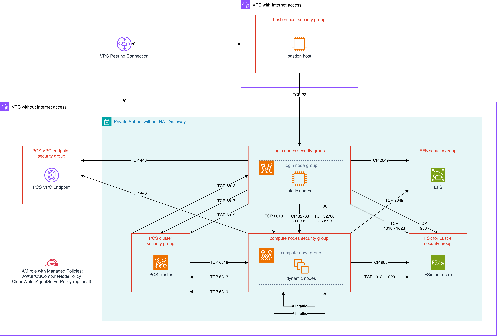

# Building an Isolated PCS Cluster with No Internet Access and Least Privilege Networking Policies

## Information

This recipe provides CloudFormation templates to create the infrastructure for deploying AWS Parallel Computing Service (PCS) clusters in fully isolated, internet-free environments, with least privilege networking policies.

### Architecture

The templates in this recipe create:

- [**Networking stack**](assets/networking/pcs-isolated-networking.yaml): 
   - A fully private VPC and a private subnet
   - A PCS VPC interface endpoint
   - Required EFA-enabled security groups for cluster nodes, storage, and the PCS VPC endpoint

- [**Storage stacks (optional, can be deployed independently)**](assets/storage):
   - An Amazon EFS file system with mount targets
   - An Amazon FSx for Lustre high-performance file system

- [**Launch template stack**](assets/cluster/pcs-isolated-launch-template.yaml):
   - An EC2 launch template for the cluster login node
   - An EC2 launch template for the cluster compute nodes

- [**PCS cluster stack**](assets/cluster/pcs-isolated-cluster.yaml):
   - Required IAM role and instance profiles
   - AWS PCS cluster with:
      - A login node group (1 static instance)
      - A compute node group (by default, 0 to 4 dynamic hpc8a.96xlarge instances)
      - A queue named "compute"

### Considerations

- **Software installation**: Compute nodes have no internet connectivity. All software packages, container images, and dependencies must be:
  - Pre-installed in AMIs (use AWS PCS sample AMIs or customize them)
  - Available through VPC endpoints (e.g., S3 Gateway Endpoint for accessing S3)
  - Your cluster should be accessible via a bastion host or on-premises connections (VPN/Direct Connect)

- **VPC endpoints**: A PCS VPC Endpoint is automatically created by the networking stack for private API access to PCS control plane. You may need additional VPC endpoints for other AWS services:
    - `com.amazonaws.<region>.logs` - For CloudWatch Logs
    - `com.amazonaws.<region>.s3` - S3 Gateway Endpoint for bucket access
    - `com.amazonaws.<region>.ecr.api` and `com.amazonaws.<region>.ecr.dkr` - For container images
    - `com.amazonaws.<region>.ssm`, `ssmmessages`, `ec2messages` - For Systems Manager Session Manager

- **DNS Resolution**: The VPC has DNS hostnames enabled to support VPC endpoint DNS resolution. The PCS endpoint has Private DNS enabled, so PCS API calls automatically resolve to the private endpoint.

- **Security Groups**: 
  - PCS VPC endpoint security group allows HTTPS (443) from cluster, login, and compute node security groups
  - Follow AWS PCS security group requirements for proper Slurm communication between controller, compute nodes, and login nodes
- **Storage Independence**: Storage stacks are independent and can be deployed, updated, or deleted without affecting the main infrastructure or other storage stacks.

## Usage 

### 0. Pre-requisites

#### 1. Amazon Machine Images (AMIs) for AWS PCS

When deploying the launch template (Step 3), you will need to input as a parameter a **`LoginAmiId`** and a **`ComputeAmiId`**.

- **Recommended: Use AWS PCS Sample AMIs**: AWS provides pre-built sample AMIs based on Amazon Liunx 2023, with Slurm 25.11 and generally required HPC software already installed. These AMIs are regularly updated and tested by AWS. Nevertheless, sample AMIs are for demonstration purposes and are **not recommended for production workloads**.

   What's pre-installed in AWS PCS sample AMIs:
   - ✅ AWS PCS agent
   - ✅ Slurm scheduler
   - ✅ Elastic Fabric Adapter (EFA) drivers
   - ✅ Lustre client (for FSx for Lustre)
   - ✅ NFS utilities (for Elastic File System and FSx for NetApp ONTAP)
   - ✅ HPC libraries (OpenMPI, Intel MPI)
   - ✅ Common compilers and development tools

   To find AWS PCS sample AMIs, see [AWS PCS Sample AMIs](https://docs.aws.amazon.com/pcs/latest/userguide/working-with_ami_samples.html).

- **Alternative: Customizing AWS PCS Sample AMIs**: To create custom AMIs based on AWS PCS sample AMIs, see [Custom AMIs for AWS PCS](https://docs.aws.amazon.com/pcs/latest/userguide/working-with_ami_custom.html).

#### 2. EC2 key pair

When deploying the launch template (Step 3), you will need to input as a parameter a **`LoginAmiId`** and a **`ComputeAmiId`**.

This is for SSH access to login nodes. You can create one via:
   - **AWS Console**: EC2 → Key Pairs → Create key pair
   - **AWS CLI**: `aws ec2 create-key-pair --key-name <key name> --region <region>`
   
Save the private key securely - you'll need it to SSH into login nodes.

### Step 1: Deploy Networking Infrastructure

Deploy the [`pcs-isolated-networking.yaml`](assets/networking/pcs-isolated-networking.yaml) template to create the VPC, subnets, and security groups. Parameters include:
   - `VpcCIDR`: CIDR block for the VPC (e.g., 10.0.0.0/16)
   - `SubnetAZ/CIDR`: Availability Zone and CIDR for the subnet
   - `SrunPortRange`: Port range that Slurm srun uses for interactive job I/O
   - `CreateEFS`: Set to 'True' if you plan to deploy EFS (creates security group)
   - `CreateFSxLustre`: Set to 'True' if you plan to deploy FSx for Lustre (creates security group)
   - `ClientIpCidr`: IP range allowed to SSH to login nodes
   - `HpcRecipesS3Bucket`: S3 bucket containing the templates
   - `HpcRecipesBranch`: Branch/version of the templates

> [!NOTE]
> This stack creates a Security Group named <stack name>-PCSEndpoint-SG, with a self-referencing egress rule. This egress rule is not required, but was added to override the default allow-all egress rule. This egress rule can be removed after creation. 

### Step 2: Deploy Storage Infrastructure (Optional)

Deploy any of the storage stacks as needed. Each storage stack is independent and can be deployed in any order.

#### Deploy Amazon EFS (if CreateEFS was set to 'True' in Step 1)

Deploy the [`pcs-isolated-efs.yaml`](assets/storage/pcs-isolated-efs.yaml) template to create the EFS file system. Parameters include:
   - `NetworkingStackName`: Name of the pcs-isolated-networking stack from Step 1
   - `EFSPerformanceMode`: generalPurpose or maxIO
   - `EFSThroughputMode`: bursting or elastic

#### Deploy FSx for Lustre (if CreateFSxLustre was set to 'True' in Step 1)

Deploy the [`pcs-isolated-fsxl.yaml`](assets/storage/pcs-isolated-fsxl.yaml) template to create the EFS file system. Parameters include:
   - `NetworkingStackName`: Name of the pcs-isolated-networking stack from Step 1
   - `FSxLustreStorageCapacity`: Storage capacity in GiB (minimum 1200, increments of 2400)
   - `FSxLustrePerUnitStorageThroughput`: Throughput in MB/s/TiB (125, 250, 500, or 1000)
   - `FSxLustreDataCompressionType`: Data compression (NONE or LZ4 for automatic compression)

> [!NOTE]
> This template uses FSx for Lustre PERSISTENT_2 deployment type, which is available in most commercial AWS regions, but may not be available in GovCloud regions.

### Step 3: Create Launch Templates

Before creating the PCS cluster, deploy launch templates that configure security groups and mount storage on both compute and login nodes. This single stack creates two launch templates.

1. Find the AWS PCS sample AMI IDs for your region from the [AWS PCS AMI Release Notes](https://docs.aws.amazon.com/pcs/latest/userguide/ami-release-notes.html) or have your custom AMI ID ready.

2. Deploy the [`pcs-isolated-launch-template.yaml`](assets/cluster/pcs-isolated-launch-template.yaml) template. Parameters include:
   - `NetworkingStackName`: Name of the pcs-isolated-networking stack from Step 1
   - `OperatingSystem`: Select your OS - must match your AMI
   
   **For SSH Access**:
   - `KeyName`: EC2 key pair for SSH access to login nodes (select from dropdown)
   
   **For Storage Configuration** (all optional):
   - `EFSStackName`: Name of the EFS stack if you deployed EFS
   - `EFSMountDirectory`: Mount point for EFS (e.g., /home)
   - `FSxLustreStackName`: Name of the FSx Lustre stack if you deployed FSx Lustre
   - `FSxLMountDirectory`: Mount point for FSx Lustre (e.g., /fsx)

   **For Login Node Configuration**:
   - `LoginInstanceType`: EC2 instance type for login nodes (e.g., c6a.4xlarge)
   - `LoginAmiId`: AWS PCS sample AMI ID for login nodes (e.g., `ami-0xxxxxxxxxxxxx`)
   
   **For Compute Node Configuration**:
   - `ComputeInstanceType`: EC2 instance type for compute nodes (e.g., c6i.32xlarge, hpc7a.96xlarge)
   - `ComputeAmiId`: AWS PCS sample AMI ID for compute nodes (e.g., `ami-0xxxxxxxxxxxxx`)

<ins>Key Differences Between Launch Templates</ins>:

| Feature | Compute Node Template | Login Node Template |
| ------- | --------------------- | ------------------- |
| Security Group | ComputeNodeSecurityGroupId | LoginNodeSecurityGroupId |
| SSH Key | ❌ No SSH access | ✅ SSH key enabled |
| Storage Mounting | ✅ Mounts EFS and FSx Lustre | ✅ Mounts EFS and FSx Lustre |
| Typical Instance Types | c6in.32xlarge, hpc7a.96xlarge | c6a.4xlarge, g4dn.4xlarge |

> [!NOTE]
> The launch templates include user data that: mounts configured storage at instance launch (EFS, FSx Lustre) and logs all setup activities to `/var/log/pcs-lt-userdata-setup.log`. The launch templates do NOT install software - required software should be pre-installed in the AMI.

### Step 4: Deploy the PCS Cluster

Deploy the [`pcs-isolated-cluster.yaml`](assets/cluster/pcs-isolated-cluster.yaml) template to create your cluster with login and compute node groups. Parameters include:
   - `NetworkingStackName`: Name of the pcs-isolated-networking stack from Step 1
   - `LaunchTemplateStackName`: Name of the pcs-isolated-launch-template stack from Step 3
   - `ClusterName`: Name for your PCS cluster (e.g., isolated-hpc-cluster)
   - `ClusterSize`: Size of the cluster - SMALL (up to 100 instances), MEDIUM (up to 500), or LARGE (up to 5000)
   - `SlurmVersion`: Slurm version (must match your AMI - typically 25.11)
   - `EnableAccounting`: Enable Slurm accounting database (default: enabled)
   - `AccountingPolicyEnforcement`: Slurm accounting policies to enforce (default: associations,limits,safe)
   - `LoginNodeInstanceType`: Instance type for login nodes (e.g., c6a.xlarge)
   - `ComputeNodeInstanceType`: Instance type for compute nodes (e.g., hpc8a.96xlarge)
   - `ComputeNodeMinCount`: Minimum number of compute nodes (0-4)
   - `ComputeNodeMaxCount`: Maximum number of compute nodes (1-4)

After deployment, you can access the cluster via one of the access patterns below.

## Access Patterns

Since this is an isolated cluster with no internet access, you'll need one of these access patterns:

### Option 1: Bastion Host with VPC Peering
Deploy a bastion host in a separate VPC (or an existing VPC with internet access) and use VPC peering to connect to the isolated PCS VPC.

**Setup steps:**
1. Create a VPC peering connection between the bastion VPC and the isolated PCS VPC
2. Accept the peering connection
3. Update route tables:
   - In the bastion VPC: Add a route to the isolated PCS VPC CIDR pointing to the peering connection
   - In the isolated PCS VPC: Add a route to the bastion VPC CIDR pointing to the peering connection in **all private subnet route tables**
4. Update security groups:
   - Bastion VPC: Allow outbound SSH (port 22) to PCS VPC CIDR
   - PCS Login Node Security Group: Already configured to allow SSH from `ClientIpCidr` (set this to bastion VPC CIDR when deploying networking stack)
5. SSH from bastion host to login nodes using their private IP addresses

### Option 2: AWS Systems Manager Session Manager
Use AWS Systems Manager Session Manager to establish sessions to login nodes without requiring a bastion host or direct internet connectivity. Additional IAM permissions, security group rules, and a VPC endpoint for Systems Manager will be required - see [this re:Post article](https://repost.aws/knowledge-center/ec2-systems-manager-vpc-endpoints) for more details. 

### Option 3: VPN or Direct Connect
Connect through AWS Site-to-Site VPN or AWS Direct Connect from your on-premises network.

## Further information

### Cleaning Up

To delete the resources created by this recipe (in reverse order of deployment):

1. Delete the PCS cluster stack (pcs-isolated-cluster).
2. Delete the launch template stack (pcs-isolated-launch-template).
3. Delete any storage stacks (pcs-isolated-efs, pcs-isolated-fsxl, pcs-isolated-fsxn) that you deployed.
4. Delete the main networking stack (pcs-isolated-networking).
5. If you created any additional resources (bastion hosts, VPN connections, etc.), delete those as well.

### References

- [AWS PCS VPC and subnet requirements and considerations](https://docs.aws.amazon.com/pcs/latest/userguide/working-with_networking_vpc-requirements.html)
- [Access AWS Parallel Computing Service using an interface endpoint (AWS PrivateLink)](https://docs.aws.amazon.com/pcs/latest/userguide/vpc-interface-endpoints.html)
- [Amazon EFS Using VPC security groups](https://docs.aws.amazon.com/efs/latest/ug/network-access.html)
- [Amazon FSx for Lustre File system access control with Amazon VPC](https://docs.aws.amazon.com/fsx/latest/LustreGuide/limit-access-security-groups.html)
