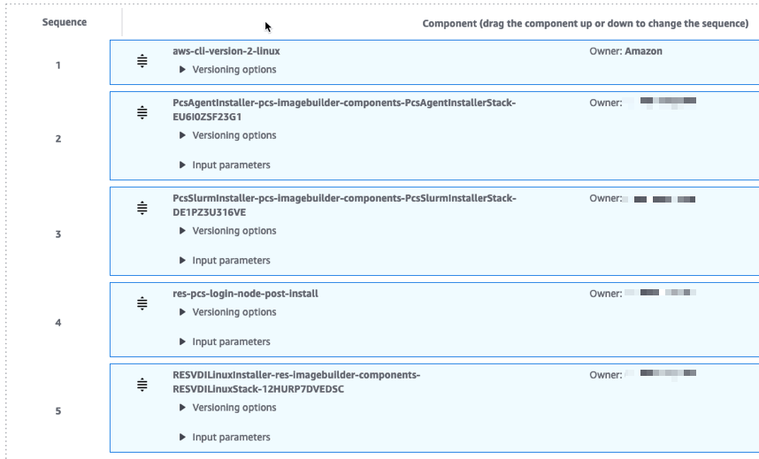
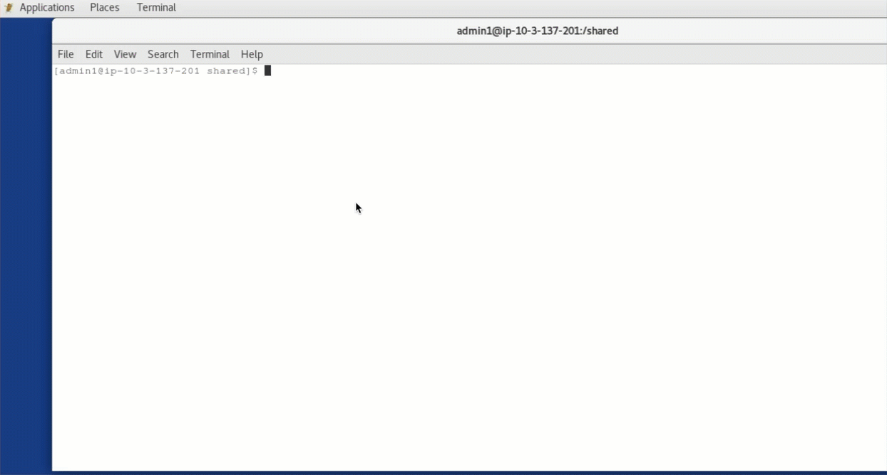

# Creating a RES-ready AWS PCS login node

## Info

This recipe demonstrates how to create a [Research and Engineering Studio (RES)](https://github.com/aws/res) compatible [AWS Parallel Computing Service (PCS) login node](https://docs.aws.amazon.com/pcs/latest/userguide/working-with_login-nodes_standalone.html). The login node Amazon machine image (AMI) can be used in RES as a software stack to submit HPC jobs to the PCS cluster.

## Assumptions

- RES deployed
- PCS deployed (_in the same VPC as RES_)
- An EFS or FSx for Lustre file system is shared between RES and PCS compute nodes

## RES-ready AMI integrated with PCS cluster

### 1. Deploy resources required to build RES compatible PCS login node<a name="step1"></a>

The following steps deploy the resources to create a [RES-ready](https://docs.aws.amazon.com/res/latest/ug/res-ready-ami.html) AMI integrated with PCS cluster.

1. Deploy the EC2 Image Builder components required to bootstrap RES and install PCS agent and slurm: [](https://console.aws.amazon.com/cloudformation/home?region=us-east-1#/stacks/create/review?stackName=ResPcsComponents&templateURL=https://aws-hpc-recipes.s3.us-east-1.amazonaws.com/main/recipes/pcs/login_node_for_res/assets/imagebuilder-components.yml)

   - If you don't wish to use the quick-create link, you can also download the [assets/imagebuilder-components.yml](assets/imagebuilder-components.yml) file and upload it to [AWS CloudFormation console](https://console.aws.amazon.com/cloudformation).

   1. In Parameters:
      1. For **HpcRecipesS3Bucket** choose the HPC Recipes bucket where the component is hosted. Unless you are working with a pre-release version of HPC Recipes for AWS, this will be `aws-hpc-recipes`.
      2. For **HpcRecipesBranch**, enter the release branch for the HPC Recipes bucket. Unless you are working with a pre-release version of HPC Recipes for AWS, this will be `main`.

2. Deploy additional resources required to integrate RES with PCS cluster: [](https://console.aws.amazon.com/cloudformation/home?region=us-east-1#/stacks/create/review?stackName=ResPcsIntegration&templateURL=https://aws-hpc-recipes.s3.us-east-1.amazonaws.com/main/recipes/pcs/login_node_for_res/assets/main.yml)

   - If you don't wish to use the quick-create link, you can also download the [assets/main.yml](assets/main.yml) file and upload it to [AWS CloudFormation console](https://console.aws.amazon.com/cloudformation).
   - **Note:** This stack needs to be created for each RES environment (including upgrades) and/or PCS cluster.

   1. In Parameters:
      1. For **PCSClusterId** enter the PCS cluster id (e.g. pcs_wphbc99999)
      2. For **RESEnvironment**, enter the RES environment name (e.g. res-demo)
      3. For **PCSClusterSG**, select the security group used that has access to the PCS cluster. For more details refer to [Security groups in AWS PCS](https://docs.aws.amazon.com/pcs/latest/userguide/working-with_networking_sg.html)<a name="PCSClusterSG"></a>
      4. For **ImageBuilderInfrastructureSubnet**, select a private subnet from the VPC that RES and PCS are deployed.

### 2. Build RES-ready PCS login node AMI

The next step is to create the Image Builder **recipe** and **pipeline**. This will be used to build a [RES-ready AMI](https://docs.aws.amazon.com/res/latest/ug/res-ready-ami.html) with access to a PCS cluster.

**Note:** Upgrades to RES environments and/or integration with a different PCS cluster **require a new Image Builder recipe/pipeline**.

1. Create Image Builder recipe.
2. Add the following components (_sequence is important!_). Refer to the [Prepare your EC2 Image Builder recipe](https://docs.aws.amazon.com/res/latest/ug/res-ready-ami.html#prepare-recipe) documentation for additional details.
   1. `aws-cli-version-2-linux` (Amazon owned)
   2. `PcsAgentInstaller` (Owned by me) - This component handles installation of the AWS PCS Agent
      1. **PcsAgentInstallerVersion**: latest
   3. `PcsSlurmInstaller` (Owned by me) - This component handles installation of the AWS PCS Slurm
      1. **PcsSlurmVersion**: <Slurm version - e.g. 25.05>
      2. **PcsSlurmInstallerVersion**: latest
   4. `res-pcs-login-node-post-install` (Owned by me) - This component installs the services to connect to the PCS cluster
      1. **Region:** <AWS Region for deployment - e.g. us-east-1>
      2. **ClusterId:** <PCS cluster id - e.g. pcs_axhof4inf9>
      3. **SlurmVersion:** <Slurm version - e.g. 25.05>
   5. `RESVDILinuxInstaller` (Owned by me) - This component performs RES bootstrapping
      1. **AWSAccountID:** <AWS Account ID where RES is installed>
      2. **RESEnvName:** <RES environment name - e.g. res-demo>
      3. **RESEnvRegion:** <AWS Region for deployment - e.g. us-east-1>
      4. **RESEnvReleaseVersion:** <RES release version - e.g. 2024.08>
3. Click `Create pipeline from this image`

An example Image Builder recipe is shown below:



4. Configure Image Builder image pipeline by following the steps outlined [here](https://docs.aws.amazon.com/res/latest/ug/res-ready-ami.html#image-builder-pipeline)
   1. The EC2 infrastructure configuration can be found in the Stack outputs from [Step #1.2](#step1)
5. Run Image Builder image pipeline. Refer to these [steps](https://docs.aws.amazon.com/res/latest/ug/res-ready-ami.html#run-image-pipeline) for more details.
6. Register a new software stack in RES. Refer to these [steps](https://docs.aws.amazon.com/res/latest/ug/res-ready-ami.html#register-res-ready-stack) for more details.

### 3. Add PCS Security group to RES project

Create/Update a project in RES and add the required security group to allow VDI access to PCS cluster. The security groups can be found in the Advanced Options section when [editing a Project](https://docs.aws.amazon.com/res/latest/ug/edit-project.html).

**Note:** This is the `PCSClusterSG` CloudFormation parameter provided in the stack [above](#PCSClusterSG) to integrate RES w/PCS.

### 4. Launch Login node Virtual Desktop

Deploy a Virtual Desktop using the newly created/updated project and Software stack.

You now have a Virtual Desktop instance capable of submitting jobs to a PCS cluster!



## Manually enable PCS access on RES VDI instance (Optional)

An alternate solution is to install the PCS components onto an already existing VDI session. The following steps walk you through this process.

### Create IAM Policy to access PCS cluster

1. Create the following IAM policy

Replace the following values accordingly:

- REGION - AWS Region where PCS is deployed
- ACCOUNT_ID - AWS Account ID where PCS cluster was created
- CLUSTER_ID - PCS Cluster id (e.g. pcs_wgs986563)

```json
{
  "Version": "2012-10-17",
  "Statement": [
    {
      "Action": ["pcs:getCluster"],
      "Resource": "arn:aws:pcs:<REGION>:<ACCOUNT_ID>:cluster/<CLUSTER_ID>",
      "Effect": "Allow"
    },
    {
      "Action": ["secretsmanager:getSecretValue"],
      "Resource": "arn:aws:secretsmanager:<REGION>:<ACCOUNT_ID>:secret:pcs!*",
      "Effect": "Allow"
    }
  ]
}
```

Add the following tag:

| Key          | Value           |
| ------------ | --------------- |
| res:Resource | vdi-host-policy |

2. Add IAM Policy to RES project

Update RES project with the PCS policy created.

**Note:** If the policy doesn't appear in the dropdown verify that the `res:Resource` tag referenced in step 1 was added.

### Install PCS on Virtual Desktop (VDI)

When connecting to the VDI you **must** have `sudo` rights. Use one of the following methods to connect:

- Connect to EC2 instance via Systems Manager
- Connect to VDI w/sudo access
  - Requires user is part of `RESAdministrators` Active Directory (AD) group, and group is added to RES Project

Once connected run the following script to install PCS agent, slurm and integrate with a cluster. Replace the following values:

- `CLUSTER_ID`: PCS Cluster ID (e.g. pcs_wgs83921a)
- `AWS_REGION`: AWS region to use (e.g. us-east-1).

```bash
curl -s https://raw.githubusercontent.com/aws-samples/aws-hpc-recipes/refs/heads/main/recipes/pcs/login_node_for_res/assets/enable-pcs.sh -o /tmp/script.sh && \
    chmod +x /tmp/script.sh && \
    sudo AWS_REGION='AWS_REGION' CLUSTER_ID='CLUSTER_ID' /tmp/script.sh
```
