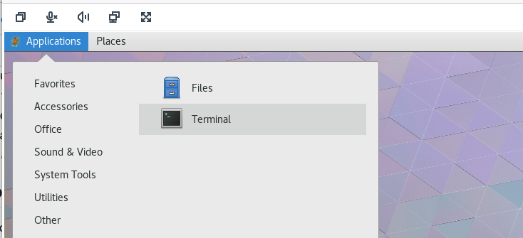
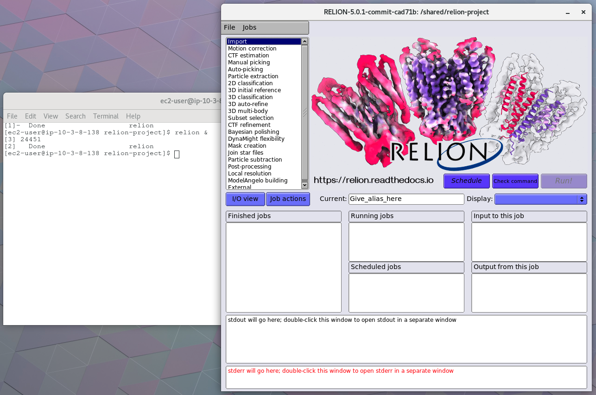

# NICE DCV Visualization Workstation for PCS with Relion

## Introduction

[NICE DCV](https://aws.amazon.com/hpc/dcv/) is a high-performance remote display protocol that lets users access graphical desktops and applications hosted on AWS. When paired with AWS Parallel Computing Service (PCS), DCV enables interactive visualization workflows — such as pre/post-processing for CFD, molecular visualization, or CAE — directly alongside HPC job submission. 

There are a few different options for integrating visualization with PCS on NICE DCV. Figure 1 provides an overview.


Options for integrating DCV with PCS for visualization:
1. **Standalone DCV workstation** — A customer-managed EC2 instance running DCV, connected to shared storage (EFS/FSx) but with no Slurm connectivity. Users visualize results only; job submission happens separately via SSH to a PCS login node. This is the simplest deployment model.
2. **Standalone DCV + BYO login node** — Same as above, but with `sackd` installed on the DCV instance, turning it into a Slurm client. Users get both visualization and job submission from a single session.
3. **DCV on a PCS login node** — DCV baked into the custom AMI for the PCS login compute node group. Slurm (`sackd`) is pre-configured by PCS. This couples the remote desktop with the cluster's login experience.
4. **DCV on a dedicated visualization compute node group** — A separate PCS compute node group (its own Slurm partition) with GPU instances and DCV pre-installed. Users submit an interactive Slurm job to get an on-demand DCV session. The node group can scale to zero when not in use, mirroring the "elastic visualization queues" concept from ParallelCluster.

This guidance covers **Option 2: Standalone DCV + BYO login node**. We will leverage existing recipes in this repo (getting_started and cfd_cluster) to set up a cluster with a standalone visualization node. We will then use the byo_login guidance to add that visualization node to the cluster.

## Prerequisites

Before starting this walkthrough, ensure you have:

- An AWS account with permissions to create EC2, IAM, Lambda, FSx, and PCS resources
- An EC2 SSH key pair in the target region
- A CIDR range for DCV/SSH access (e.g., `x.x.x.x/32` for your IP, or `0.0.0.0/0` for open access)
- AWS CLI installed and configured
- Familiarity with AWS PCS (we recommend completing the [Getting Started tutorial](https://docs.aws.amazon.com/pcs/latest/userguide/getting-started.html) first)

## Step 1: Create PCS Cluster

Use the [**pcs/getting_started**](https://github.com/aws-samples/aws-hpc-recipes/tree/main/recipes/pcs/getting_started) recipe to create a PCS cluster with networking, storage, and compute nodes.

### Launch the cluster

Use the "Create a PCS cluster with new networking" quick-launch link from the [pcs/getting_started recipe](https://github.com/aws-samples/aws-hpc-recipes/tree/main/recipes/pcs/getting_started).
Follow the instructions in that recipe with these configuration choices:

- **SlurmVersion**: Select `25.11` (the current default).
- **NodeArchitecture**: Choose `x86`.
- **Compute instance type**: Select a GPU instance type for the compute node group — `g4dn.xlarge`, `g5.xlarge`, or `g6.xlarge` depending on your budget and performance needs.
- **FSx for Lustre**: Ensure it is included (it is by default in the getting_started template).
- **KeyName**: Choose your SSH key pair.
- **ClientIpCidr**: Set to your IP CIDR or leave as `0.0.0.0/0`.

Wait for the CloudFormation stack to reach `CREATE_COMPLETE` status.

### Collect stack outputs

After the stack completes, navigate to the **Outputs** tab in the CloudFormation console and note the following values (you will need them in Step 2):

| Output | Description | How to find |
|--------|-------------|-------------|
| **Cluster ID** | PCS cluster identifier | PCS console or `aws pcs list-clusters` |
| **Cluster Security Group ID** | Security group attached to the PCS cluster | CloudFormation stack outputs |
| **Public Subnet ID** | Public subnet for the DCV workstation | CloudFormation stack outputs |
| **FSx for Lustre Filesystem ID** | Shared filesystem identifier | CloudFormation stack outputs |
| **FSx mount directory** | Mount path on instances (default: `/shared`) | CloudFormation stack outputs |

### Using an existing cluster

If you already have a PCS cluster, it must meet these minimum requirements:

- FSx for Lustre filesystem attached and mounted on compute nodes
- At least one compute node group with GPU instances (g4dn, g5, or g6 family)
- Slurm version 25.05 or later (required for the official multi-cluster login script)
- A public subnet available in the same VPC for the DCV workstation

## Step 2: Deploy DCV Workstation

This step launches a GPU-enabled DCV workstation using the modified CloudFormation template included in this recipe.

### Launch the template

Upload the template [`assets/dcv-linux-node.yaml`](assets/dcv-linux-node.yaml) to the [AWS CloudFormation console](https://console.aws.amazon.com/cloudformation/home) and create a new stack.

Alternatively, you can use the S3-hosted version:

```
https://aws-hpc-recipes.s3.us-east-1.amazonaws.com/main/recipes/pcs/nice_dcv/assets/dcv-linux-node.yaml
```

### Configure parameters

Fill in the following parameters using the outputs from Step 1:

| Parameter | Value | Notes |
|-----------|-------|-------|
| `DcvUsername` | `ec2-user` | Leave as default (recommended for PCS compatibility) |
| `Password` | (your strong password) | Used to log into the DCV web session |
| `OperatingSystem` | `AmazonLinux2-x64-Graphics-Intensive` | Required for GPU support |
| `SshKeyName` | (your SSH key) | For SSH access to the instance |
| `AllowList` | (your IP CIDR) | e.g., `x.x.x.x/32` for your IP |
| `StreamingPort` | `8443` | Leave as default |
| `DiskSize` | `100` | 50 GB minimum; 100 GB recommended for Relion builds |
| `ClusterId` | (from Step 1) | PCS cluster identifier |
| `PublicSubnetId` | (from Step 1) | Public subnet in the cluster VPC |
| `ClusterSecurityGroupId` | (from Step 1) | PCS cluster security group |
| `FSxLustreFilesystemId` | (from Step 1) | FSx for Lustre filesystem ID |
| `FSxLustreMountDirectory` | `/shared` | Must match the cluster mount path |

Under **Capabilities and transforms**, check the boxes to acknowledge IAM resource creation, then choose **Create stack**.

### Why ec2-user is recommended

The `DcvUsername` parameter defaults to `ec2-user` because this user already exists on PCS compute node AMIs with a consistent UID (1000).
When `ec2-user` submits a Slurm job from the DCV workstation, the job runs as `ec2-user` on compute nodes with no UID/GID mismatch.
Shared filesystem access works without `chmod 777` workarounds, and Slurm commands work because PCS accepts jobs from any authenticated user via sackd.

### Verify DCV connectivity

1. Wait for the DCV workstation CloudFormation stack to reach `CREATE_COMPLETE`.
2. Navigate to the **Outputs** tab and find the **LinuxDcvURL** output.
3. Open the URL in your web browser (e.g., `https://<instance-ip>:8443`).
4. You will see a self-signed certificate warning — accept it and proceed.
5. Log in with username `ec2-user` and the password you specified during stack creation.


## Step 3: Configure BYO Login Node

In this step, you configure the DCV workstation as a PCS login node so you can run Slurm commands directly from your DCV session. It's possible to open a terminal in the DCV session and complete setup from there. SSH'ing into the instance from a local terminal however will provide a better user experience. We'll do that next.

### Connect to the instance

SSH into the DCV workstation using your key pair:

```bash
ssh -i your-key.pem ec2-user@<instance-public-ip>
```

Alternatively, use AWS Systems Manager Session Manager from the EC2 console.

### Verify prerequisites

Before running the login configuration script, verify these prerequisites on the instance:

```bash
# Verify jq and curl are installed
which jq curl

# Verify the slurm user exists
id slurm

# If the slurm user does not exist, create it:
sudo groupadd -r slurm
sudo useradd -r -g slurm -s /sbin/nologin slurm

# Verify network connectivity to the PCS cluster endpoint (port 6817)
CLUSTER_ID=$(aws pcs list-clusters --query 'clusters[0].id' --output text)
ENDPOINT_IP=$(aws pcs get-cluster --cluster-identifier $CLUSTER_ID \
  --query 'cluster.endpoints[?type==`SLURMCTLD`].privateIpAddress' --output text)
timeout 5 bash -c "echo >/dev/tcp/$ENDPOINT_IP/6817" && echo "Connection successful" || echo "Connection failed"
```

### Install Slurm

The DCV AMI does not include Slurm. You must install it using the AWS PCS Slurm installer before configuring sackd.
The Slurm version must match your cluster's version (check with `aws pcs get-cluster --cluster-identifier $CLUSTER_ID --query 'cluster.scheduler.version' --output text`).

```bash
# Download the Slurm installer (replace 25.11 if your cluster uses a different version)
SLURM_VERSION=25.11
curl https://aws-pcs-repo-us-east-1.s3.us-east-1.amazonaws.com/aws-pcs-slurm/aws-pcs-slurm-${SLURM_VERSION}-installer-latest.tar.gz \
  -o aws-pcs-slurm-installer.tar.gz

# Extract and install
tar -xf aws-pcs-slurm-installer.tar.gz
cd aws-pcs-slurm-${SLURM_VERSION}-installer
sudo ./installer.sh -y
cd ..

# Verify installation
ls /opt/aws/pcs/scheduler/slurm-${SLURM_VERSION}/bin/sinfo
```

The installer takes several minutes as it compiles Slurm and its dependencies.

### Download and run the official script

```bash
# Download the AWS PCS multi-cluster login configuration script
curl -O https://aws-hpc-recipes.s3.us-east-1.amazonaws.com/main/recipes/pcs/nice_dcv/assets/pcs-multi-cluster-login-configure.sh
chmod +x pcs-multi-cluster-login-configure.sh

# Run with your cluster identifier (uses CLUSTER_ID from the prerequisite check above)
export ALTERNATE_SECRET_RETRIEVAL=true
sudo -E ./pcs-multi-cluster-login-configure.sh --cluster-identifier <cluster-id>
```

> **Note:** If the script fails or you encounter version compatibility issues, check the [AWS documentation](https://docs.aws.amazon.com/pcs/latest/userguide/multi-cluster-login-script-code.html) for an updated version of the script.

The script automatically:

- Detects the AWS region from instance metadata
- Retrieves cluster info (endpoint IP, Slurm version, secret ARN)
- Downloads the auth key from Secrets Manager
- Creates and starts a systemd service (`sackd-pcs-<cluster-name>.service`)
- Generates an activate script for setting up the Slurm environment

### Activate the Slurm environment

Source the activate script generated by the configuration script:

```bash
source ./activate-pcs-<cluster-name>
```

Add it to your `.bashrc` for persistence across sessions:

```bash
echo "source /home/ec2-user/activate-pcs-<cluster-name>" >> ~/.bashrc
```

### Verify Slurm connectivity

```bash
sinfo    # Should show cluster partitions
squeue   # Should show empty queue (or running jobs)
```

### Troubleshooting

If `sinfo` times out or the sackd service fails to start:

- **Security group rules**: Ensure the cluster security group allows inbound traffic on port 6817 from the DCV workstation.
- **IAM permissions**: Verify the instance role has `pcs:GetCluster` and `secretsmanager:GetSecretValue` permissions.
- **Slurm version mismatch**: The official script requires Slurm ≥ 25.05. Check your cluster's Slurm version in the PCS console.
- **Service logs**: Check `journalctl -u sackd-pcs-*` for detailed error messages.

## Step 4: Install Relion

Relion is built from source with GPU support using system packages for all dependencies.
No Spack installation is required.

### Download the Relion install script

```bash
# Download the install script (from this recipe's assets)
curl -O https://aws-hpc-recipes.s3.us-east-1.amazonaws.com/main/recipes/pcs/nice_dcv/assets/install-relion.sh
chmod +x install-relion.sh
```

### Run the installer

The script installs all dependencies via system packages (OpenMPI, FFTW, libtiff, libpng, X11) and builds Relion from source.
The `--cuda-arch` flag should match your GPU instance type.
If omitted, the script attempts auto-detection.

| Instance Family | GPU | CUDA Architecture |
|-----------------|-----|-------------------|
| g4dn (T4) | NVIDIA T4 | `--cuda-arch 75` |
| g5 (A10G) | NVIDIA A10G | `--cuda-arch 86` |
| g6 (L4) | NVIDIA L4 | `--cuda-arch 89` |

Example with explicit architecture:

```bash
sudo ./install-relion.sh --cuda-arch 75
```

Example with auto-detection:

```bash
sudo ./install-relion.sh
```

Installation takes 20–40 minutes depending on instance type.
The script prints status messages for each phase so you can monitor progress.

### Verify Relion installation

```bash
source /etc/profile.d/relion.sh
which relion    # Should show /shared/relion/bin/relion
```

## Step 5: Verify End-to-End

Run through this checklist to confirm everything is working together.

### 1. DCV session accessible

Open `https://<instance-ip>:8443` in your browser and log in with `ec2-user`. ✓

### 2. Slurm connectivity from DCV session

Open a terminal in the DCV desktop session:



Run:

```bash
sinfo    # Should show cluster partitions
```

### 3. Submit a test job

```bash
# Check available partitions
sinfo -o "%P"

# Submit a test job (replace 'compute' with your partition name from sinfo)
sbatch --wrap="hostname && date" -o /shared/test-job.out -p <partition-name>
squeue   # Watch job status
```

The output should look like this:

```
             JOBID PARTITION     NAME     USER ST       TIME  NODES NODELIST(REASON)
                 1      demo     wrap ec2-user CF       3:32      1 compute-1-1

```

Note that we configured the cluster to have a minimum number of nodes to zero, meaning when no jobs are running, there are zero EC2 instances deployed. This job is in a `CF` or Configuring state while an EC2 instance is dynamically provisioned. You can check the EC2 console to see the instance beign provisioned in your account.

When the job completes, the instance will terminate after writing data back to shared filesystem. To view the output files, run:

```bash
cat /shared/test-job.out  # Verify output after job completes
```

### 4. Launch Relion GUI

```bash
cd /shared
mkdir -p relion-project && cd relion-project
relion &
```

The Relion GUI should appear in your DCV session.



## Step 5. [Optional]: Submit a Relion GPU job to PCS

At this point we have a DCV workstation added as a BYO login node to PCS. Relion is installed, and the GUI is running in the DCV session. We've also validated we can submit slurm jobs to the cluster from the DCV session running on the workstation.

To submit a Relion GPU job to PCS, we need to add node groups and queues to the cluster for GPU jobs. This repository includes CloudFormation templates for adding one node group for single GPU instances, and another for multi-GPU instances. 

Instructions on how to add these node groups are in [Appendix: Adding GPU Compute Node Groups](#appendix-adding-gpu-compute-node-groups).

Once the compute nodes are added, jobs can be submitted from the Relion GUI. The Relion documentation offers a Single Particle tutorial including a test dataset.

The tutorial can be found here: https://relion.readthedocs.io/en/latest/SPA_tutorial/Introduction.html

## Operational Guidance

### Connecting to DCV

You can connect to the DCV session using:

- **Web browser**: Navigate to `https://<instance-ip>:8443`. Works from any device without additional software.
- **Native DCV client**: Download from [NICE DCV client downloads](https://docs.aws.amazon.com/dcv/latest/userguide/client.html). Provides better performance for 3D visualization and GPU-accelerated rendering.

### Stop/Start for Cost Savings

Stop the DCV workstation instance when not in use to avoid GPU instance charges.
On restart, the sackd and DCV services restart automatically (systemd enabled).

To resume work after a restart:

```bash
# Source the activate script (or rely on .bashrc if you added it earlier)
source /home/ec2-user/activate-pcs-<cluster-name>
```

### Instance Type Recommendations

| Instance Type | Use Case | Notes |
|---------------|----------|-------|
| g4dn.xlarge | Budget option | Good for basic visualization, 1 T4 GPU |
| g5.xlarge | Recommended | Better GPU (A10G), good for interactive Relion use |
| g5.2xlarge+ | Heavy preprocessing | More CPU/RAM for local preprocessing tasks |

### Service Recovery After Restart

After stopping and starting the instance, verify services are running:

```bash
systemctl status dcvserver       # DCV server should be active
systemctl status sackd-pcs-*     # sackd service should be active
```

Both services are configured to start automatically via systemd.

## Production Considerations

### Active Directory Integration

For production deployments, replace local password authentication with Active Directory (AD):

- Join the DCV instance to AWS Managed Microsoft AD.
- Configure SSSD/PAM for AD authentication.
- AD users get consistent UID/GID across all nodes, eliminating permission workarounds.
- Reference the [`pcs/multiuser_demo`](../multiuser_demo/) recipe for AD integration patterns with PCS.

### Multi-User Access

Multiple AD users can have separate DCV sessions on the same instance, each authenticated via AD credentials.
This enables shared infrastructure with per-user isolation.

### Secrets Management

In production, avoid passing the DCV password as a CloudFormation parameter.
Use AWS Secrets Manager or AD authentication instead for credential management.

### EFA for Multi-Node MPI at Scale

This walkthrough uses system OpenMPI, which communicates over TCP.
For production multi-node MPI workloads that require low-latency networking, install the [AWS EFA software](https://docs.aws.amazon.com/AWSEC2/latest/UserGuide/efa-start.html) and use the EFA-optimized OpenMPI at `/opt/amazon/openmpi/`.
EFA is supported on instance types like p4d, p5, hpc6a, and g5 (in cluster placement groups).

## Cost Estimation

Primary cost drivers for this architecture:

| Resource | Approximate Cost | Notes |
|----------|-----------------|-------|
| DCV workstation (g4dn.xlarge) | ~$0.526/hr | Charged while instance is running |
| DCV workstation (g5.xlarge) | ~$1.006/hr | Charged while instance is running |
| Compute nodes (GPU) | Per-job only | PCS scales to zero when idle |
| FSx for Lustre | ~$0.14/GB-month | 1.2 TB minimum ≈ $168/month |
| Data transfer | Minimal | Stays within the same AZ |

**Tip:** Stop the DCV workstation when not in use to avoid GPU instance charges.
Compute nodes are only charged when jobs are running (PCS scales the node group to zero automatically).

## Troubleshooting

### DCV connection refused

- Verify the security group allows inbound traffic on port 8443 from your IP.
- Confirm the instance is in the `running` state.
- Check the DCV server status: `systemctl status dcvserver`.

### sackd service won't start

- Check service logs: `journalctl -u sackd-pcs-*`.
- Verify the security group allows traffic on port 6817 between the DCV workstation and the PCS cluster endpoint.
- Verify IAM permissions (`pcs:GetCluster`, `secretsmanager:GetSecretValue`).

### Slurm commands timeout

- Check network connectivity between the public and private subnets.
- Verify security group egress rules allow outbound traffic to the PCS endpoint.
- Confirm the activate script has been sourced: `echo $SLURM_CONF`.

### Relion GUI won't launch

- Ensure you are in an active DCV session (not just SSH).
- Check the DISPLAY variable: `echo $DISPLAY`.
- Verify the GPU is accessible: `nvidia-smi`.
- Confirm Relion is in PATH: `source /etc/profile.d/relion.sh && which relion`.

### FSx mount not accessible

- Check security group rules allow Lustre ports (988, 1021–1023) between the instance and FSx.
- Verify the mount: `df -h | grep shared`.
- Check the FSx filesystem status in the AWS console.

### Cannot run Slurm commands

- Source the activate script: `source /home/ec2-user/activate-pcs-<cluster-name>`.
- Verify PATH includes Slurm binaries: `which sinfo`.
- Check `sinfo` output for error messages.

### Slurm commands fail with "Parsing error at unrecognized key" after installing Relion

If you have Spack installed separately and load OpenMPI from Spack, it may pull in an older Slurm version that overrides the PCS Slurm 25.11 binaries in your PATH.
Symptoms include errors like `_parse_next_key: Parsing error at unrecognized key: HashPlugin` or `Invalid DebugFlag: AuditRPCs`.

Fix by ensuring the PCS Slurm path takes priority:

```bash
export PATH="/opt/aws/pcs/scheduler/slurm-25.11/bin:$PATH"
sinfo
```

Or re-source the activate script (which sets the correct PATH order):

```bash
source /home/ec2-user/activate-pcs-<cluster-name>
```

The `install-relion.sh` script's profile script (`/etc/profile.d/relion.sh`) automatically restores PCS Slurm to the front of PATH on new shell sessions.

## Cleanup

Delete resources in reverse order to avoid orphaned dependencies:

1. **Delete the DCV workstation CloudFormation stack** — removes the GPU instance, security group rules, and IAM role.
2. **Delete the PCS cluster CloudFormation stack** (from `pcs/getting_started`) — removes the cluster, node groups, networking, and FSx filesystem.
3. **If you created filesystems separately**, delete those last after confirming no instances reference them.

**Note:** If you created additional PCS resources (extra node groups, queues) beyond what the CloudFormation stack manages, delete those in the PCS console before deleting the CloudFormation stack.

## Appendix: Adding GPU Compute Node Groups

The PCS sample AMI (`aws-pcs-sample_ami-al2023-x86_64-slurm-25.11`) includes NVIDIA drivers out of the box. When launched on GPU instance types (g4dn, g5, g6, g6e), `nvidia-smi` works without any additional driver installation. No custom AMI is required.

### Create GPU node groups

You'll need values from your existing compute node group. Retrieve them with:

```bash
aws pcs get-compute-node-group --cluster-identifier <your-cluster-id> \
  --compute-node-group-identifier compute-1
```

Then create the GPU node groups:

```bash
# Single-GPU node group (g4dn.2xlarge — 1x NVIDIA T4)
aws pcs create-compute-node-group \
  --cluster-identifier <your-cluster-id> \
  --compute-node-group-name gpu-single \
  --ami-id <your-pcs-ami-id> \
  --subnet-ids <your-subnet-id> \
  --instance-configs '[{"instanceType":"g4dn.2xlarge"}]' \
  --scaling-configuration '{"minInstanceCount":0,"maxInstanceCount":4}' \
  --iam-instance-profile-arn "<your-instance-profile-arn>" \
  --custom-launch-template '{"id":"<your-launch-template-id>","version":"1"}' \
  --purchase-option ONDEMAND

# Multi-GPU node group (g6e.4xlarge)
aws pcs create-compute-node-group \
  --cluster-identifier <your-cluster-id> \
  --compute-node-group-name gpu-multi \
  --ami-id <your-pcs-ami-id> \
  --subnet-ids <your-subnet-id> \
  --instance-configs '[{"instanceType":"g6e.4xlarge"}]' \
  --scaling-configuration '{"minInstanceCount":0,"maxInstanceCount":4}' \
  --iam-instance-profile-arn "<your-instance-profile-arn>" \
  --custom-launch-template '{"id":"<your-launch-template-id>","version":"1"}' \
  --purchase-option ONDEMAND
```

### Create queues for GPU node groups

PCS requires queues (Slurm partitions) mapped to compute node groups before you can submit jobs. Get the node group IDs from the previous step, then create the queues:

```bash
# Get GPU node group IDs
aws pcs list-compute-node-groups --cluster-identifier <your-cluster-id> \
  --query 'computeNodeGroups[?name==`gpu-single` || name==`gpu-multi`].[name,id]' --output table

# Create queue for single-GPU jobs
aws pcs create-queue \
  --cluster-identifier <your-cluster-id> \
  --queue-name gpu-single \
  --compute-node-group-configurations '[{"computeNodeGroupId":"<gpu-single-cng-id>"}]'

# Create queue for multi-GPU jobs
aws pcs create-queue \
  --cluster-identifier <your-cluster-id> \
  --queue-name gpu-multi \
  --compute-node-group-configurations '[{"computeNodeGroupId":"<gpu-multi-cng-id>"}]'
```

### Verify GPU node groups

From the DCV workstation (after sourcing the activate script):

```bash
sinfo  # Should show gpu-single and gpu-multi partitions

# Submit a test GPU job
sbatch --partition=gpu-single --wrap="nvidia-smi" -o /shared/gpu-test.out
cat /shared/gpu-test.out  # Verify GPU output after job completes
```

### Notes

- Both node groups scale to zero when idle — you only pay for GPU instances when jobs are running.
- The `--ami-id` parameter is required because the launch template does not specify an AMI.
- You can reuse the same launch template and IAM instance profile as your CPU node group.
- If you need a custom AMI (e.g., for additional pre-installed software), launch a temporary GPU instance from the PCS sample AMI, customize it, then create an AMI with `aws ec2 create-image`.
- To find your existing node group configuration (subnet, IAM profile, launch template), run:
  ```bash
  aws pcs get-compute-node-group --cluster-identifier <cluster-id> \
    --compute-node-group-identifier compute-1
  ```
