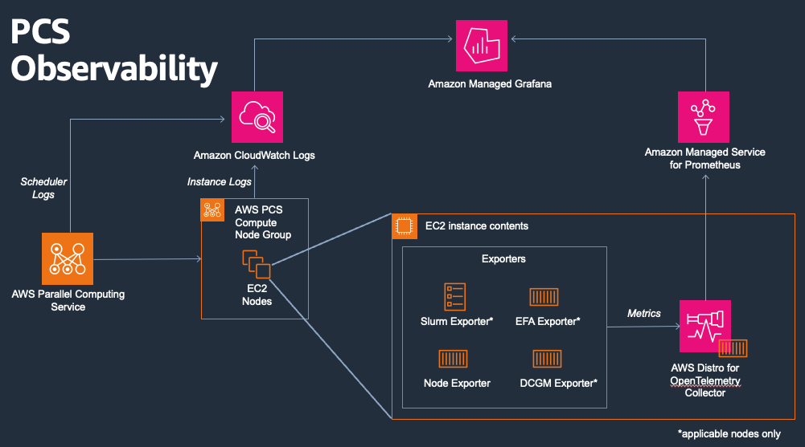

# Monitoring for PCS

Copyright Amazon.com, Inc. or its affiliates. All Rights Reserved.
SPDX-License-Identifier: MIT-0

## Legal Disclaimer
This sample code is provided as-is with no warranty. Use at your own risk.

## Info

This recipe helps you setup a Grafana-based observability solution for PCS as defined in [_Monitoring AWS PCS_](https://aws.amazon.com/blogs/hpc/).  It's designed for users seeking resource performance metrics in their PCS cluster across Slurm job, partition, and cluster levels.  The solution also provides searchable PCS Amazon CloudWatch Logs within Grafana.

## Architecture



## Security Considerations

- **IAM Permissions**: This solution requires specific AWS Identity and Access Management (IAM) permissions for Prometheus write access and S3 bucket access. Review the PrometheusWritePolicy in observability-stack.yaml.
- **Network Access**: Compute nodes require internet access to install software from public repositories.
- **Data Privacy**: Metrics collected may contain cluster usage patterns. Ensure compliance with your organization's data retention policies.  S3 bucket is created with public access blocked, but consider implementing S3 access logging to gain insights into resource usage.  This project currently uses AWS-owned KMS keys and the CloudFormation template can be modified by users for customer-owned KMS keys.
- **Authentication**: Amazon Managed Grafana uses AWS IAM Identity Center. Ensure proper user access controls are configured.

## Templates

This section contains CloudFormation templates for creating the observability solution. Follow the directions in the AWS PCS user guide to use them.

### Component Templates
* [`observability-stack.yaml`](assets/observability-stack.yaml) - Creates Amazon Managed Service for Prometheus and Amazon Managed Grafana workspaces, along with related IAM roles.

## Prerequisites

1. AWS IAM Identity Center must be configured and accessible within the AWS account.  Please view  [`enable IAM Identity Center`](https://docs.aws.amazon.com/singlesignon/latest/userguide/enable-identity-center.html) for details.  Amazon Managed Grafana uses IAM Identity Center for authentication.  

2. Ensure that at least one user is setup and enabled within IAM Identity Center.  Please view [`Set up your workforce in IAM Identity Center`](https://docs.aws.amazon.com/singlesignon/latest/userguide/identities.html).  You may configure Active Directory users, IAM Identity Center directory users, or other external IdP users depending on your environment's identity configuration.

3. Setup a PCS Cluster.  If you do not already have a cluster, view [`Creating a cluster`](https://docs.aws.amazon.com/pcs/latest/userguide/working-with_clusters_create.html) or use the [`Get started with CloudFormation and AWS PCS`](https://docs.aws.amazon.com/pcs/latest/userguide/get-started-cfn.html) quickstart.

4. Internet access.  This installation assumes that PCS nodes have access to the internet to install software from public repositories.

5. Go version 1.21+ installed on your AMIs.  This is a requirement for the slurm node exporter.  Note that the observability-userdata-controller.sh and observability-userdata-compute.sh scripts have GOPATH set as such: "export GOPATH=/usr/local/go". If your Go installation is at a different location, modify this variable in both scripts to reflect your Go installation path.

## Usage

1. Deploy the observability stack [`observability-stack.yaml`](assets/observability-stack.yaml) via CloudFormation.  Wait for successful deployment before going on to the next step.  You will need to refer back to the CloudFormation outputs in future steps.

2. Add the observability IAM policy to your PCS cluster Amazon EC2 IAM instance profiles.  The observability IAM policy's ARN can be found in step 1's CloudFormation output, with output key "PrometheusWritePolicyArn".  You can obtain the EC2 IAM instance profiles for each of the cluster's compute node groups using the [`Get compute node group details in AWS PCS`](https://docs.aws.amazon.com/pcs/latest/userguide/working-with_cng_get-details.html) instructions and looking for the IAM instance profile value.  For each of the EC2 IAM instance profile values, add the observability IAM policy to the instance profile.  Sample instructions for [`adding policy to IAM role`](https://docs.aws.amazon.com/IAM/latest/UserGuide/id_roles_update-role-permissions.html).
    * Note: You will need one always-on compute resource to publish slurm metrics and in this example, we do this from the login node.  You could also do this from another EC2 instance joined to the cluster, where potential options are defined in the [`Login nodes`](https://docs.aws.amazon.com/pcs/latest/userguide/working-with_login-nodes.html) section of the AWS PCS documentation.

3. Update the [`observability-userdata-compute.sh`](assets/observability-userdata-compute.sh) and [`observability-userdata-controller.sh`](assets/observability-userdata-controller.sh) scripts to replace the value "<PROMETHEUS_SSM_PARAM>" with the value of the "PrometheusRemoteWriteUrlParameterName" CloudFormation Output.  Upload both of these scripts to the Amazon Simple Storage Service (Amazon S3) bucket created by the CloudFormation, found in the output "ScriptsBucketName".

    ```shell
    aws s3 cp observability-userdata-controller.sh s3://<bucket-name>/
    aws s3 cp observability-userdata-compute.sh s3://<bucket-name>/
    ```

4. Update the login node compute node group (or alternative always-on cluster node, see note in step 2) launch template to install the observability agents on the node.  This requires the following changes to the launch template:

    a. Enable Instance Metadata Tags.  By default, tags are not available using instance metadata as described in [`View tags using instance metadata`](https://docs.aws.amazon.com/AWSEC2/latest/UserGuide/work-with-tags-in-IMDS.html).  This setting can be set at *MetadataOptions:InstanceMetadataTags* in the launch template.

    b. Add Docker installation to launch template user data.  Docker is necessary to run the exporter containers.  
    
    Amazon Linux, RHEL, Rocky Linux
    ```shell
    MIME-Version: 1.0
    Content-Type: multipart/mixed; boundary="==MYBOUNDARY=="

    --==MYBOUNDARY==
    Content-Type: text/cloud-config; charset="us-ascii"
    MIME-Version: 1.0

    packages:
    - docker

    runcmd:
    # Start Docker service
    - systemctl start docker
    - systemctl enable docker
    - usermod -a -G docker ec2-user

    --==MYBOUNDARY==
    ```

    Ubuntu
    ```shell
    MIME-Version: 1.0
    Content-Type: multipart/mixed; boundary="==MYBOUNDARY=="

    --==MYBOUNDARY==
    Content-Type: text/cloud-config; charset="us-ascii"
    MIME-Version: 1.0

    packages:
    - docker.io

    runcmd:
    # Start Docker service
    - systemctl start docker
    - systemctl enable docker
    - usermod -a -G docker ubuntu

    --==MYBOUNDARY==
    ```

    c. Add observability software installation script to launch template user data.  Replace "<bucket_placeholder>" with the S3 bucket name from the CloudFormation output "ScriptsBucketName".
    ```shell
    Content-Type: text/x-shellscript; charset="us-ascii"
    MIME-Version: 1.0
    Content-Transfer-Encoding: 7bit
    Content-Disposition: attachment; filename="userdata.txt"

    #!/bin/bash
    aws s3 cp s3://<bucket_placeholder>/observability-userdata-controller.sh .
    chmod +x observability-userdata-controller.sh
    bash -x ./observability-userdata-controller.sh
    --==MYBOUNDARY==--
    ```

5. Update all other compute node group's launch template to install the observability agents on the node.  This requires the following changes to the launch template:

    a. Enable Instance Metadata Tags.  By default, tags are not available using instance metadata as described in [`View tags using instance metadata](https://docs.aws.amazon.com/AWSEC2/latest/UserGuide/work-with-tags-in-IMDS.html).  This setting can be set at *MetadataOptions:InstanceMetadataTags* in the launch template.

    b. Add Docker installation to launch template user data.  Docker is necessary to run the exporter containers.
    Amazon Linux, RHEL, Rocky Linux
    ```shell
    MIME-Version: 1.0
    Content-Type: multipart/mixed; boundary="==MYBOUNDARY=="

    --==MYBOUNDARY==
    Content-Type: text/cloud-config; charset="us-ascii"
    MIME-Version: 1.0

    packages:
    - docker

    runcmd:
    # Start Docker service
    - systemctl start docker
    - systemctl enable docker
    - usermod -a -G docker ec2-user

    --==MYBOUNDARY==
    ```

    Ubuntu
    ```shell
    MIME-Version: 1.0
    Content-Type: multipart/mixed; boundary="==MYBOUNDARY=="

    --==MYBOUNDARY==
    Content-Type: text/cloud-config; charset="us-ascii"
    MIME-Version: 1.0

    packages:
    - docker.io

    runcmd:
    # Start Docker service
    - systemctl start docker
    - systemctl enable docker
    - usermod -a -G docker ubuntu

    --==MYBOUNDARY==
    ```

    c. Add observability software installation script to launch template user data.  Replace "<bucket_placeholder>" with the S3 bucket name from the CloudFormation output "ScriptsBucketName".
    ```shell
    Content-Type: text/x-shellscript; charset="us-ascii"
    MIME-Version: 1.0
    Content-Transfer-Encoding: 7bit
    Content-Disposition: attachment; filename="userdata.txt"

    #!/bin/bash
    aws s3 cp s3://<bucket_placeholder>/observability-userdata-compute.sh .
    chmod +x observability-userdata-compute.sh
    bash -x ./observability-userdata-compute.sh
    --==MYBOUNDARY==--
    ```

5. Configure the user permissions for accessing Amazon Managed Grafana.  Go to the Amazon Managed Grafana service in the AWS Console and select the link for your Grafana Workspace name.  Setup access for your desired user(s) using the [`Amazon Managed Grafana user access instructions`](https://docs.aws.amazon.com/grafana/latest/userguide/AMG-manage-users-and-groups-AMG.html).  Select "Make admin" for at least one of your users, as this will be required to setup the data source connections.

6. Configure the Amazon Managed Service for Prometheus data source in Grafana.  Login to your Grafana workspace URL, which can be found either in the AWS Managed Grafana service console or in the pcs-observability CloudFormation stack output "GrafanaWorkspaceUrl".  In Grafana, go to the Apps > AWS Data Sources section and select Service = Amazon Managed Service for Prometheus, your AWS region, and the prometheus data source (the resource id will match prometheus workspace id at the end of the CloudFormation output "PrometheusWorkspaceArn").  Select "Add data sources".

7. Configure the Amazon CloudWatch data source in Grafana.  In Grafana, Go back to Apps > AWS Data Sources and select Service = CloudWatch, your AWS region, and the regional data source.  Select "Add data sources".

8. Import the PCS Observability Grafana dashboards into your Grafana workspace.  The Grafana dashboards can be found in this repository in the assets/grafana/ folder.  In Grafana, go to Dashboards > New > Import, then upload the ClusterDashboard json file.  Select your prometheus data source, then choose import.  Repeat for PartitionDashboard and JobsDashboard.  For the CloudWatchLogsDashboard, go to Dashboards > New > Import, then upload the ClusterDashboard json file and select CloudWatch as the data source.  It is recommended to setup the [`Node Exporter Grafana Dashboard`](https://grafana.com/grafana/dashboards/1860-node-exporter-full/), which can be linked to the JobsDashboard.

## License

This library is licensed under the MIT-0 License.  See the LICENSE file.