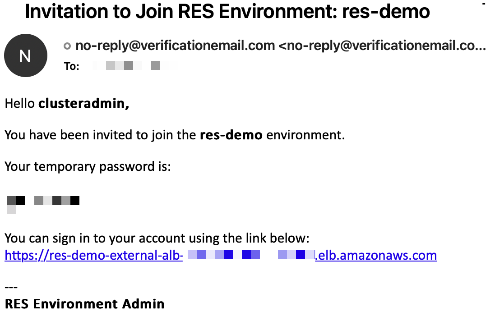
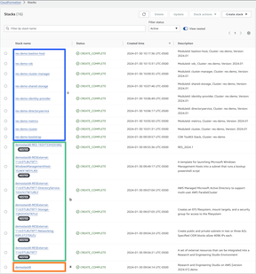

# Research and Engineering Studio (RES) on AWS demo environment

## Info

This recipe uses a CloudFormation stack to launch a non-production installation of [Research and Engineering Studio (RES) on AWS](https://aws.amazon.com/hpc/res/) that you can use to try it out. It also includes a CloudFormation stack that can be used standalone to launch just the supporting infrastructure for RES (networking, directory service, storage, etc.)

## Usage

### Launch RES

1. Ensure you have an Amazon EC2 [SSH key created](https://docs.aws.amazon.com/AWSEC2/latest/UserGuide/create-key-pairs.html#having-ec2-create-your-key-pair) in the Region where you want to launch RES.
2. Launch the template: 
3. Follow the instructions in the AWS CloudFormation console. 
4. Monitor the status of the stack named **resdemostack**. When its status is `CREATE_COMPLETE`, check your email for a message with the subject line **Invitation to Join RES Environment**. Follow the instructions you find there to log in as `clusteradmin` and change your password.

#### Optional: Exploring the CloudFormation resources

RES is deployed using interconnecting CloudFormation stacks. Here is an example of a RES deployment in a clean AWS account. 

The main stack, launched by the demo template above is named *demostack8* (**a** in the figure). It in turn launches several child stacks. Each of those is named *demostack8-ResourceName* (**b**). One of those resources is named *demostack8-RES-Identifier*. This is the actual RES application stack. It deploy several child stacks of its own, named *res-demo-ModuleName* after the RES environment name (**c**).

## RES External Resources stack

RES has several infrastructure depdendencies, such as networking, a directory service, EFS volumes, and management instances. The demo recipe above creates them using the RES External Resources template. You can use that stack directly to create a foundation upon which to install RES. 
1. Learn more about its features and usage in the [docs](docs/README.md).
2. Launch the RES External Resources template: 
3. Deploy RES into cloud resources created by the RES External Resources stack. See the RES [User Guide](https://docs.aws.amazon.com/res/latest/ug/deploy-the-product.html) for details.

## Cleaning Up

When you are done using these resources, you can delete it by navigating to the AWS CloudFormation console and deleting the relevant stack(s). If you have enabled termination protection, you will need to disable it first. Consult the [AWS CloudFormation User Guide](https://docs.aws.amazon.com/AWSCloudFormation/latest/UserGuide/Welcome.html) for more details.

