# Configuring AWS Identity Center for Batteries Included

The Batteries Included cloud templates creates an Active Directory with some test users, admins, and groups. In order to use the RES environment a Single Sign-On (SSO) will need to be configured so that users and admins can log into the web site. Theses directions use the AWS Identity Center to configure the SSO for a RES environment.

These steps are to set up the Identity Center connection to the Batteries Included managed directory.

NOTE: Make sure the region is set to the same region that the BI cloud stack was installed. 

## Enable Identity Center

1. In the AWS Console, navigate to the [AWS Identity Center](https://console.aws.amazon.com/singlesignon/home)
2. Click the `Enable` button

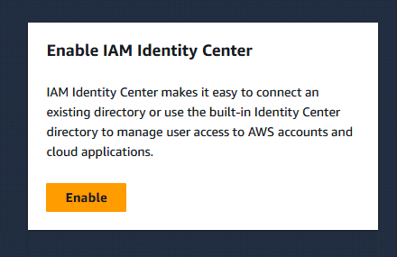

NOTE: If the `Enable` button is not present, you will need to delete the Identity Center's current configuration in the region it is currently registered. (link)

## Connecting Identity Center to the BI active directory

After enabling identity center, you will be directed to complete recommended set up steps.

Choose Choose your identity source.

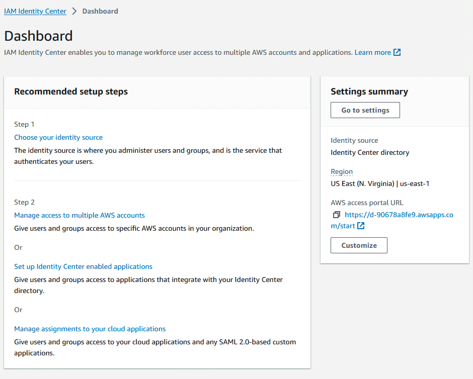

Under Identity Source, choose Actions and choose Choose identity source

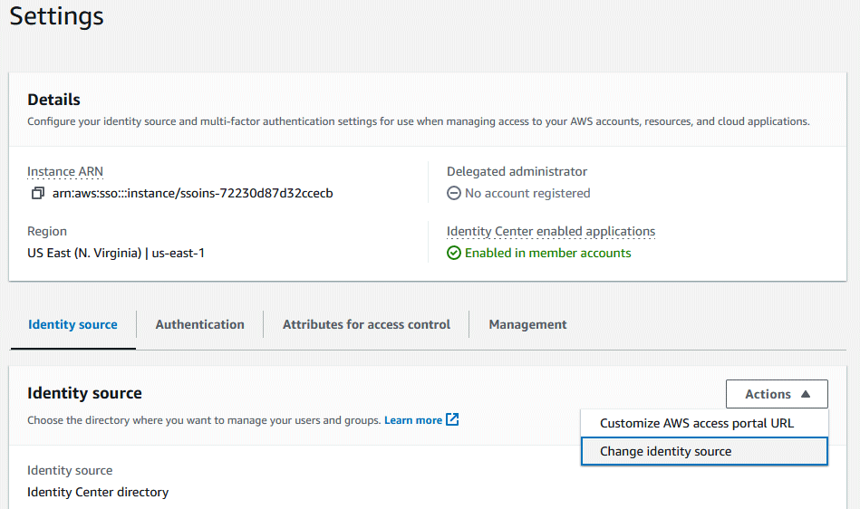

Select the `Active Directory` option, 

You will select the managed directory that was created by the BI stack in this region.

1. Under `Existing Directories`, select the directory that was created for this region.
2. Choose `Next`.
3. Review your changes and enter `ACCEPT` in the confirmation box.
4. Choose `Change identity source`.

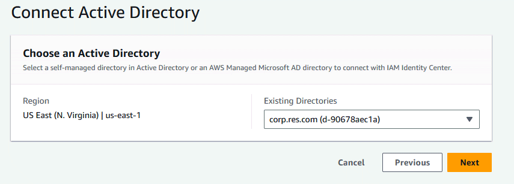

This will show a check list `Configuring IAM Identity Center` in progression.

## Sync BI users and groups

In the confirmation banner, choose `Start guided setup`.

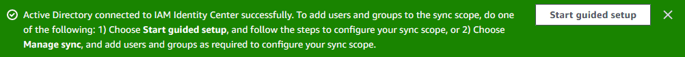

From Configure attribute mappings, choose Next.
	
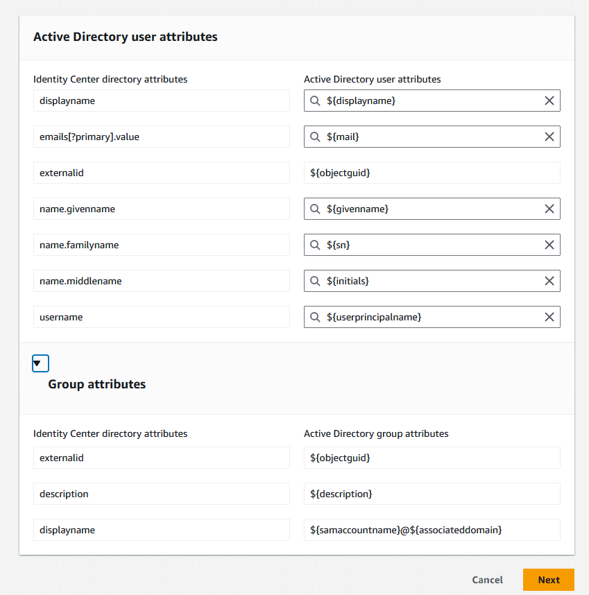

## Syncing users and groups to identity center

In the 'Configure sync scope' page there are two tabs: `Users` and `Groups`. The `corp.res.com` directory should already be selected. Next enter the `user1` user name, then select the `Add` button. The users tab should look similar to this picture after adding `user1`, `user2`, `admin1`, `admin1` entries.

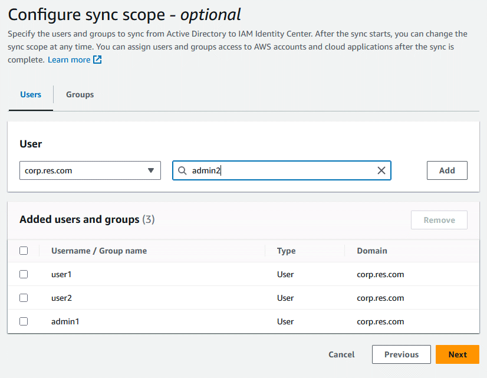

Now select the `Groups` tab in order to add the `group_1` and `group_2` groups.

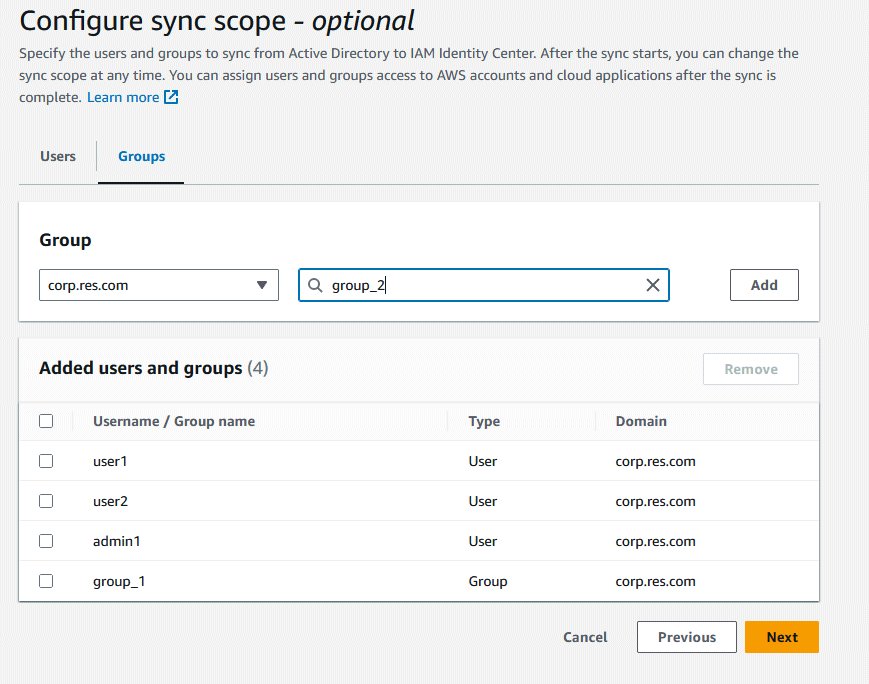

To start the sync of the users and groups:

1. Choose `Next` button to continue.
2. Review your changes and choose `Save` configuration. 
3. Choose `Resume sync`.

## Enabling users

The users and groups may take up to fifteen minutes to sync from the managed directory to Identity Center. When the sync tool is finished the Users sub page will show all the users.

The user entry needs to be `Enabled` here in order to log into RES with SSO credentials. 

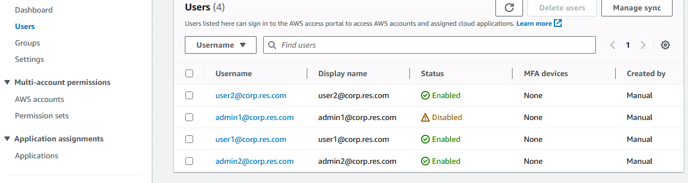

In this example the "admin1@corp.res.com" entry is set to the "Disabled" status. You must click on the Username label (i.e. "admin1@corp.res.com") in order to enable that user.

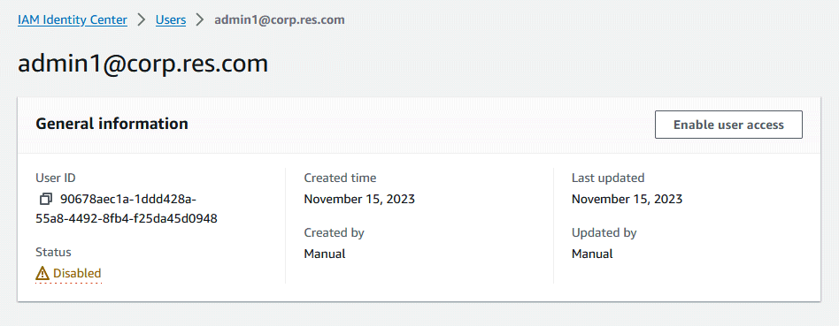

To enable the user you click on the `Enable user access` in the `General information` for the "admin1@corp.res.com" user.

After you have enabled all the users in the Batteries Included stack, you are ready to add an Application and wire up the RES environment using these [Step 2: Connect to an identity center
](https://docs.aws.amazon.com/res/latest/ug/manage-users.html) instructions.

# Troubleshooting an existing Identity Center

The AWS Identity Center can only be active for a single region for a single account. If the an account has already set up SSO using AWS Identity Center you might need to delete the existing Identity Center in that previous region. 

If you see a message like "IAM Identity Center is currently configured in the US East (N. Virginia) Region" then to enable AWS Identity Center for another region, click on the link that states "...you must first delete the current IAM Identity Center configuration in..." 

1. Switch the previous region
2. Choose `Settings` on the left
3. Choose `Management` in Settings 
4. Choose `Delete` in the `Delete IAM Identity Center configuration`

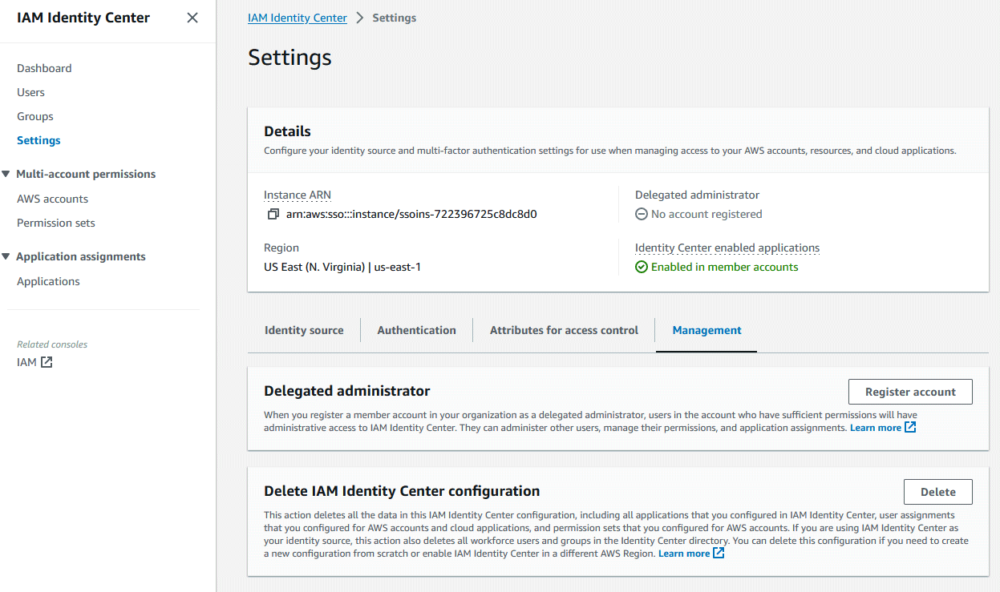
