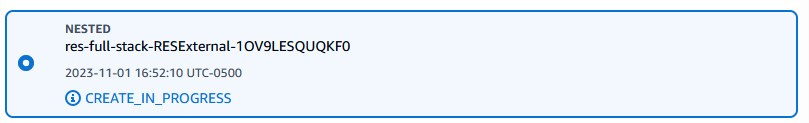
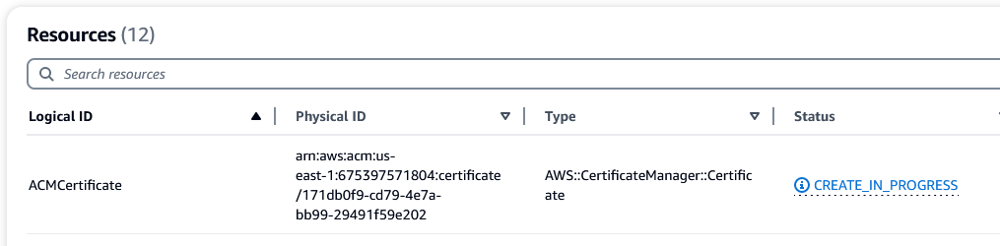
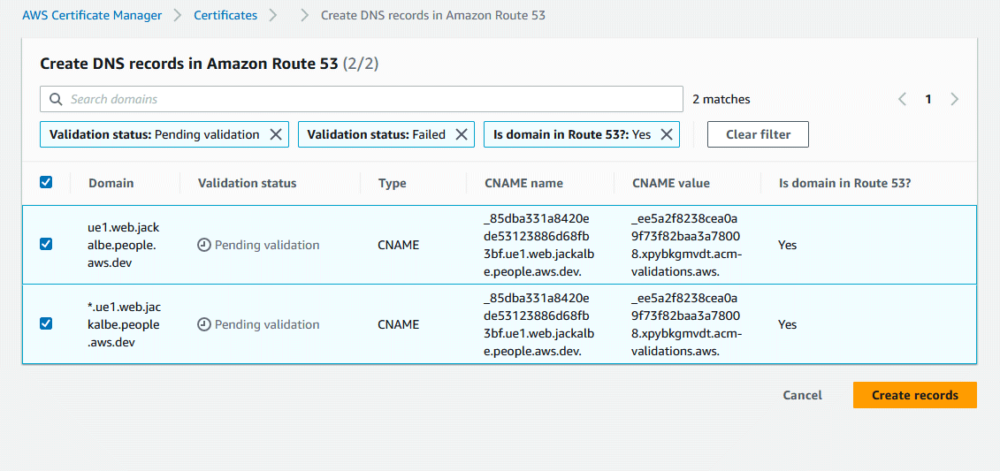

# Finalizing AWS certificates

When a new subdomain is use the `ACMCertificate` resource might need a manual step to complete.

If the stack seems to be stuck in the base RESExternal state as `CREATE_IN_PROGRESS`:

and the ACMCertificate Resource has been in progress for over fifteen minutes:

then the solution might be to create records for the subdomain in the AWS Certificate Manager service.

Inside the AWS Certificate Manager > Certificate, find the one in the `Pending validation` state:

Choose the `Create records in Route 53` button.

Select the `Create records` button. This will help the pending validation.