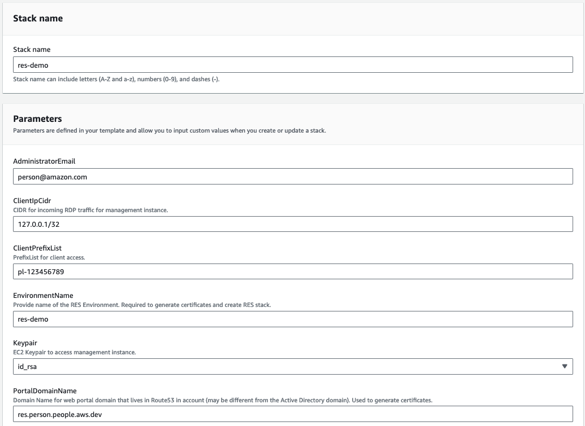
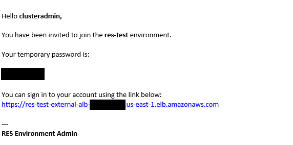

# Using the 'RES with Batteries Included' demo template

The `res-with-batteries-included.yaml` file combines the cloud resources Batteries Included (`bi.yaml`) template and the RES installation template (`ResearchAndEngineeringStudio.template.json`). This demo only works in commercial regions, but offers a few advantages:

1. A single cloud stack helps building and tearing down the environment
2. Fewer input parameters

The input parameters are:

- `PortalDomainName` - (Optional) Domain Name for web portal domain that lives in Route53 in account (may be different from the Active Directory domain). Used to generate certs, leave blank to skip certificate generation.
- `Keypair` - EC2 key pair to access management instance.
- `EnvironmentName` - (Optional) Provide name of the Environment, the name of the environment must start with "res-" and should be less than or equal to 10 characters. (required for generating certificates)
- `AdministratorEmail` - Provide an Email Address for the environment administrator account. You will receive an email with your temporary credentials during environment installation. After the solution is deployed, you can use the temporary credentials to login and reset the password.
- `ClientIpCidr` - CIDR for incoming RDP traffic for management instance. Default IP(s) allowed to directly access the Web UI and SSH into the bastion host.
- `ClientPrefixList` - (Optional) A valid prefix list ID for incoming traffic for the management instance. This allows more CIDR blocks to access the RES environment than a single block from 'ClientIpCidr'

The Keypair must be created in [EC2](https://console.aws.amazon.com/ec2#KeyPairs:) before creating this cloud formation stack.

For the IP CIDR, it is recommend to restrict the UI with your own IP/subnet (x.x.x.x/32 for your own ip or x.x.x.x/24 for range. Replace x.x.x.x with your own PUBLIC IP. You can get your public IP using tools such as https://ifconfig.co/).

The ClientPrefixList can be created in [VPC](https://docs.aws.amazon.com/vpc/latest/userguide/working-with-aws-managed-prefix-lists.html)

Once the stack is finished the admin email should receive a message with a temporary password.

For Example:

