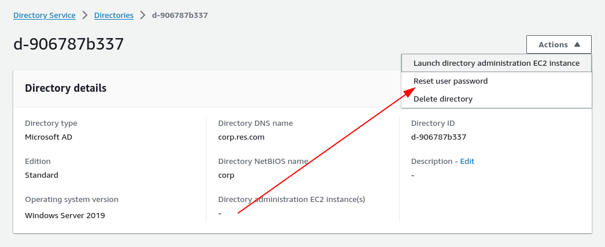
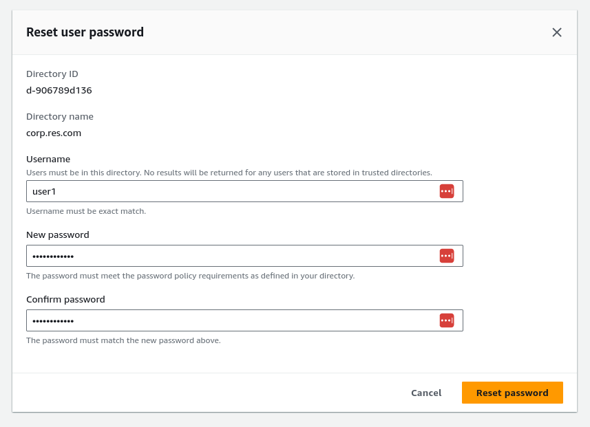

# Learn how to manage Users and Groups

## Default Users and Groups

The default users and groups that are setup as a part of the automated setup (based off of the supplied LDIF file) has the following structure:

* `corp.res.com`
    * OU: `corp`
        * OU: `RES`
            * OU: `Users`
                * User: `user1`
                * User: `admin1`
                * Group: `RESAdministrators`, members: `[admin1, admin2]`
                * Group: `group_1`, members: `[user1, admin1]`
                * Group: `group_2`, members: `[user2, admin2]`
            * OU: `Computers`
                * Will be used by service account to create computers needed to connect with the AD
        * OU: `Users`  # created by default via AD recipe
            * User: `ReadOnlyUser` # used as service account, created by default via AD recipe
            * User: `Admin` # Admin account created by AD recipe, not used by RES
            * User: `user2`
            * User: `admin2`

The purpose of this structure is to demonstrate how the hierarchy in an ActiveDirectory map into the users and groups that exist inside of RES.

The outputs from the automated stack contain values for OUs that are inputs to RES. Using these values, we can see that the users `user1` and `admin1` will be synchronized into RES because they belong to the RES OU. Additionally, users `user2` and `admin2` will be synchronized because they belong to groups (`group_1` and `group_2`) that also exist in the RES OU (even though, as AD objects they exist outside of the RES OU).

Additionally, when `group_1` is assigned to a project, only the members of that group will be able to access that given project.

Finally, the users `admin1` and `admin2` will be given `sudo` access across all projects because they exist in the sudoers group (which is currently statically defined as `RESAdministrators`)

## Setting Passwords for login users

The passwords for these users need to be set in the [DirectoryServices console](https://console.aws.amazon.com/directoryservicev2/home). Select the directory that was created as a part of the stack and select **Reset user password** from the **Actions** menu.

